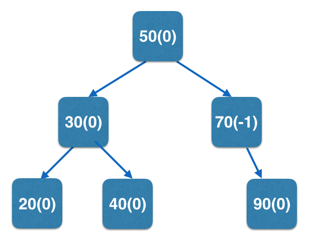

AVLTreeElement<K,E> implements an _AVL Tree element_ in BRIDGES and is inherited from BSTElement<E>.

    

    ## How does the AVLTreeElement<K,E> work?

    AVLTreeElement<K,E> is nearly identical to BSTElement<K,E>, however, it is to be used for building AVL trees, a type of balanced binary search trees (Other examples of balanced search trees include Red-Black Trees, 2-3 Trees). AVL tree inherits all data members and methods of a BSTElement<K,E>, but includes two additional attributes: a _balance factor_, which represents the difference between the heights of its left and right subtrees, and _height_, that keeps track of the height of the tree at the node.

    An example AVL tree is shown below (and used in the live example further down) with key values and balance factors(in parens):

    

    - - -

    ## AVL Tree - BRIDGES Example

    Java

    C++

    Python

    ### Bridges Visualization

    -   Once all your code is in order, run your program.
    -   Assuming all your code is correct and it compiles correctly, a link to the Bridges website will be generated.
    -   Copy/paste this link into your favorite browser to view a visualization of the data structure you’ve just created.
    -   It should look something like this; mouse over the nodes or hit 'l' to turn on the labels. You will see the balance factors for each node.

    
Sorry, your browser doesn't seem to support iframes - <a href="/assignments/111/bridges_public" >Frame Link</a> 

    Well done! You’ve just created an AVL Tree!

    w3IncludeHTML(); document.querySelector("\*.tabs > \*").click();