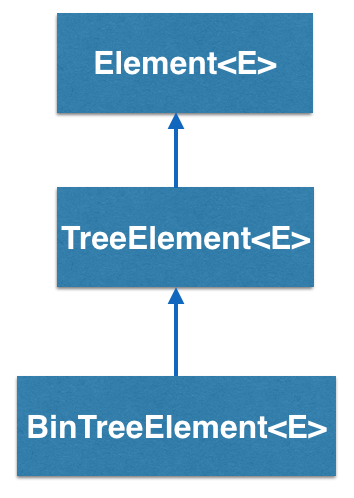
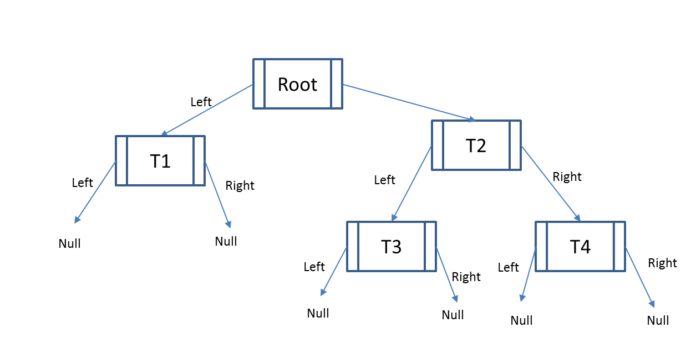

BinTreeElement<E> implements a _binary tree element_ in BRIDGES and is inherited from Element<E>

  

  ## How does the BinTreeElement<E> work?

  BinTreeElement<E> is another type of container that has two links pointing to its two children, also binary tree elements. By convention, these two links are called "left" and "right and the top of the tree is referred to as the "root".

  

  In the example above, Root has two links, so calling Root.getLeft() will return the TreeElement T1 and calling Root.getRight() will return the TreeElement T2.

  Note that there is no pointer from T1 or any other element back to its root.

  ## How does a BinTreeElement<E> differ from a DLelement<E>?

  Structurally, DLelement<E> and TreeElement<E> are similar with 2 emanating links, but they are used in very different data structures. In a doubly linked list, the links point to the immediately following and previous element, while in the binary tree they point to its two children(recursively, as can be seen in the above example).

  - - -

  ## BinTreeElement - BRIDGES Example: A Huffman Coding Tree

  Java

  C++

  Python

  ### Bridges Visualization

  -   Once all your code is in order, run your program.
  -   Assuming all your code is correct and it compiles correctly, a link to the Bridges website will be generated.
  -   Copy/paste this link into your favorite browser to view a visualization of the data structure you’ve just created.
  -   It should look something like this:

  
Sorry, your browser doesn't seem to support iframes - <a href="/assignments/109/bridges_public">Frame Link</a> 

  Well done! You’ve just created your Bridges Binary Tree project!