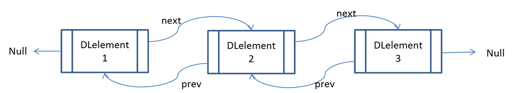

DLelement<E> is the basic building block used to implement _doubly linked lists_ in BRIDGES and is inherited from Element<E>

  

  ## How does the DLelement<E> work?

  DLelement<E> stands for Doubly Linked Element, and is a container that has two links, pointing to two other doubly linked elements. So a DLelement<E> “knows” who it’s pointing at, AND it knows who pointed at it.

  

  In this example, calling getNext() on DLelement2 will return DLelement3. Calling getPrev() on DLelement2 will return DLelement1. DLelement3 does not have a next pointer pointing to another DLelement so calling getNext() on DLelement3 will return NULL, indicating the end of the linked elements.

  Notice that, since DLelement<E> has a getPrev() method, you can move forwards AND backwards through the linked elements.

  - - -

  ## DLelement - BRIDGES Example

  Java

  C++

  Python

  ### Bridges Visualization

  -   Once all your code is in order, run your program.
  -   Assuming all your code is correct and it compiles correctly, a link to the Bridges website will be generated.
  -   Copy/paste this link into your favorite browser to view a visualization of the data structure you’ve just created.
  -   It should look something like this:

  
Sorry, your browser doesn't seem to support iframes - <a href="/assignments/104/bridges_public">Frame Link</a> 

  Well done! You’ve just created your doubly linked list!