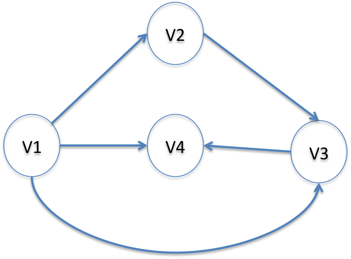

## How do the GraphAdjList<K,E> and GraphAdjMatrix work<K,E>?

A graph is a set of vertices connected by edges. Unlike tree structures, a vertex can be an ancestor or a child and can have multiple emanating edges. In fact, a tree structure is just a special case of a graph.

Bridges represents graph structures in one of two ways: either using an adjacency list representation or an adjacency matrix representation. Access to the vertices is similar to indexing into an array (O(1) complexity). The main difference is that vertex ids can be numerical values or strings; BRIDGES implements constant access to vertices using maps (in Java and C++).

In the adjacency list representation, the GraphAdjList is holding a Map of vertices, each of which associated with a linked list of the vertices representing the terminating vertex of the edge. These _Edge_ vertices are of type SLElement<E> with the generic object E used to hold the vertex id and possibly, edge weight.

In the adjacency matrix representation, the GraphAdjMatrix is mimicking a 2 dimensional array to describe which vertices are connected (BRIDGES implements this using nested Maps). Finally these classes provide some convenient methods to add vertices and edges (GraphAdjList::addVertex(), GraphAdjList::addEdge()) to build the graph.

Typically, the reason to use one version over the other revolves around space /time trade offs, end-user application and the density of the graph. Since the GraphAdjList representation uses a linked list to track neighboring nodes, searching for a particular vertex is a linear (O(n)) operation. The GraphAdjMatrix has O(1) access to any particular neighbor, but it is essentially holding a two dimensional array, regardless of the graph density; on sparse graphs, this can waste a considerable amount of space.

- - -

## Graph - BRIDGES Example Using IMDB Actor/Movie Data

## Example Details

Here we will illustrate an adjacency list based graph with the IMDB Actor/Movie dataset. We will display the subgraph making up the movies of two chosen actors, Kevin Bacon and Denzel Washington. The example will illustrate how to build the graph from the dataset and illustrate traversing the adjacency lists.

### Bridges Visualization

-   Once all your code is in order, run your file.
-   Assuming all your code is correct and it compiles correctly, a link to the Bridges website will be generated.
-   Copy/paste this link into your favorite browser to view a visualization of the data structure you’ve just created.
-   It should look something like this:

Sorry, your browser doesn't seem to support iframes - <a href="/assignments/112/bridges_public">Frame Link</a> 

Well done! You’ve just created your Bridges Graph project!

**These examples show the use of graphs - both adjacency list and adjacency matrix based representations. There are slight differences between the C++ and Java Graph classes due to the initialization related issues. In C++, templates can be intitialized with paramaters, while in Java this is not permitted. Thus we derive simpler versions of the Graph classes (GraphAdjListSimple and GraphAdjMatrixSimple); other than that the calling sequences across both languages are almost identical. example using Adjacency Matrix (using Bridges::GraphAdjacencyMatrix) is nearly identical.**