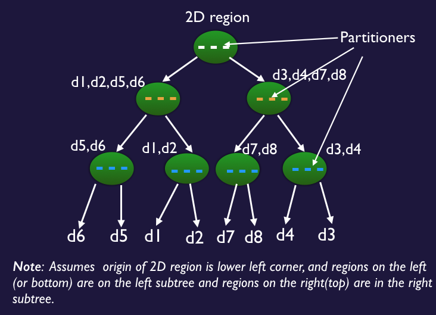

KdTreeElement<K,E> implements a _Kd Tree element_ and is inherited from BSTElement<K,E>

## How does the KdTreeElement<K,E> work?

KdTreeElement<K,E> is a type of container that has two links that point to two child KdTree elements. It uses the same conventions as the BSTElement<E>.

At this point, you may be wondering how a KdTreeElement<K,E> differs from a regular Binary Search Tree Element. The fundamental difference between the two classes is that the KdTreeElement<K,E> is used to build _search trees_ on spatial domains, and can extend to 2 or more dimensions. It holds additional pieces of data, the generic parameter K, called the "key" like the binary search tree, except that it represents a spatial partitioning value along a dimension. In addition, partitioning dimension is also specified at the node and can be X or Y or Z (for 3D version of the tree). The key is used to enforce a spatial ordering on the underlying spatial domain.

A typical example would be a Kd tree where all of the keys of the left child are smaller than the keys of the right child, for that dimension. Kd Trees can be used to partition space recursively along any of the dimensions and typically leads to a convex partitioning of the original space. It can be used to represent 2D images, for instance and belongs to the class of partitioning trees, as quadtrees (partitions into 4 equal sized regions and used in 2D), octrees (into 8 regions in 3D). See the figures below for a better understanding.

 

- - -

## KdTreeElement - Tree Example

We illustrate a simple example of building a Kd Tree of 3 levels with the partitioning dimension alternating between X and Y. Click the Label button to see the partitioning dimension in this tree. (This page is under construction.)

### Bridges Visualization

-   Once all your code is in order, run your program.
-   Assuming all your code is correct and it compiles correctly, a link to the Bridges website will be generated.
-   Copy/paste this link into your favorite browser to view a visualization of the data structure you’ve just created.
-   It should look something like this:

Sorry, your browser doesn't seem to support iframes - <a href="http://bridges-clone.herokuapp.com/assignments/112/bridges_public">Frame Link</a> 

Well done! You’ve just created your Bridges Kd-Tree project!