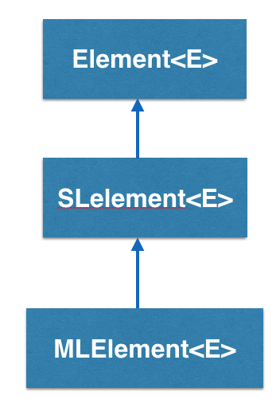
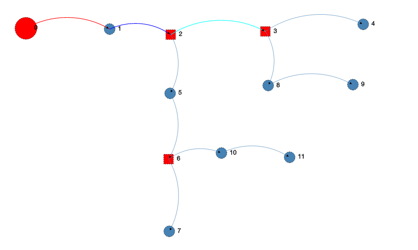

MLelement<E> is the basic element used to implement a _Multilist_ in BRIDGES and is inherited from SLelement<E>

## How does the MLelement<E> work?

This class extends SLelement (singly linked list element) to build multi-lists; multilists extend singly linked lists, by allowing any element of the list to be a list. Multilist elements contain a tag (getTag()/setTag()) that indicates if the element is a sublist or not; If the element points to a sublist, then the sublist field is the beginning of this sublist. If not, the data field contains the user specified data item and list continues (getNext()/setNext()). As in singly linked elements, the next pointer points to the following list element of the list or sublist. Full class documentation at MLElement .

- - -

## MLelement - An Example BRIDGES program

### Bridges Visualization

-   Once all your code is in order, run your file.
-   Assuming all your code is correct and it compiles correctly, a link to the Bridges website will be generated on the console.
-   Copy/paste this link into your favorite browser to view a visualization of the data structure you just created.
-   It should look something like this:

Sorry, your browser doesn't seem to support iframes - <a href="/assignments/107/bridges_public" scrolling="no">Frame Link</a> 

Well done! You’ve just created your Multilist!