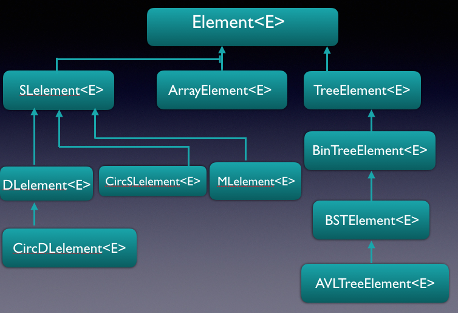
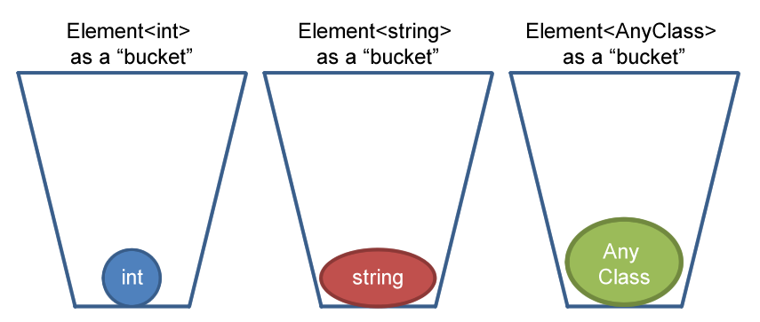

## What is Bridges?

The **BRIDGES**(_Bridging Real-world Infrastructure Designed to Goal-align, Engage, and Stimulate_), an NSF TUES project, is focused on providing easy-to-use interfaces to real-world internet-based information systems, that are exciting, engaging and commonly used by undergraduate students, such as social network data, scientific or engineering data. BRIDGES toolkit provides a set of classes(C++ and Java are supported) that serve as building blocks to the common data structures (lists, tree structures, graphs) used in freshmen/sohpomore level computer science. BRIDGES makes it easy to (1) import, use and manipulate real-world data sets as part of routine student projects, and (2) provides visualizations of the data structures constructed by the student as part of his/her project. BRIDGES currently supports the following types of Elements:

-   **Element** - the basic element(abstract) that just holds application specific data and supports some basic operations
-   **Singly Linked List Element** - element that points to one following element
-   **Doubly Linked List Element** - element that points to the following and previous elements
-   **Circular Singly Linked List Element** - singly linked element that points to itself
-   **Circular Doubly Linked List Element** - doubly linked element that points to itself
-   **Multilist Element** - Generalization of singly linked list element, that permits any element to be a sublist (recursively)
-   **Tree Element** - a general tree element with some number of children defined by the user
-   **Binary Tree Element** - element that has 2 children, pointing to a left and right child element
-   **Binary Search Tree Element** - a binary tree element with an orderable "key" value, to be used in binary search tree implementations
-   **AVL Tree Element** - a binary search tree element that also maintains balance factor and tree height values.
-   **Graph(Adjacency List)** \- graph container that holds vertices in an array type list and element connections with singly linked lists
-   **Graph(Adjcacency Matrix)** - graph container whose representation is an adjacency matrix, with vertex ids for the two dimensions, and matrix elements containing a boolean(presence/absence of edge) or edge weight.

Bridges also contains a visualization component that allows the user to send a representation of their data structure to a server, to see the data structure that they have built. The user can also change various visualization features such as size, shape, or color of the elements and their links.

## What is an Element<E>?

Element<E> is the abstract superclass of all BRIDGES elements, as shown below:

You will normally be using these classes to build data structures. Since they are subclasses of Element<E>, they inherit a common set of methods and instance variables, so to a certain extent they will share a common set of behaviors. However, since they are all different classes, they will have methods and instance variables that are unique to their type.

## What is the <E>?

BRIDGES uses generic parameters(consistent with most data structures textbooks today); <E> is a generic parameter. It represents any basic type or object(class), so you can have an SLelement<string> or an SLelement<int> or any other type. In particular, this facilitates Element to contain application specific type, for example, a record containing a (Twittter) Tweet, Earthquake, hospital, airport or a movie record.

You may be wondering, if <E> can be any type, then how does Element know how to behave since a boolean does not have the same methods available as a string?

Since we did not put any restrictions on <E> inside the Element definition, we can only call methods of <E> that are common to ALL classes. We will not be allowed to call a method on E that is particular to any one class. Also, as Element<E> is an abstract class, users only access it indirectly via its subclasses.

In this way, we can allow the Element<E> class to function as a container. The container doesn't care what it's holding and whatever the container is holding doesn't influence the behavior of the container.

## What about Graphs?

Bridges also contains the GraphAdjacencyList and GraphAdjacencyMatrix classes, however, these do not subclass from Element.
This is because Graphs themselves are containers, possibly holding Bridges elements. When you interact with the graphs you will typically be adding an Element to them or retrieving an Element from them.