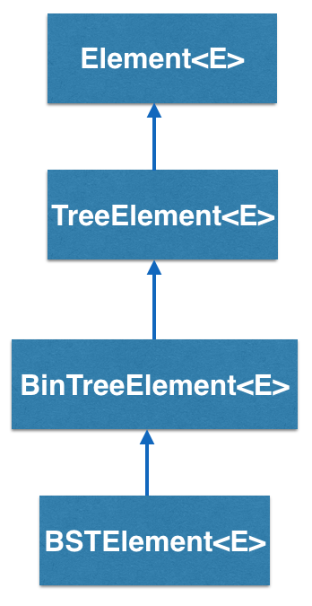
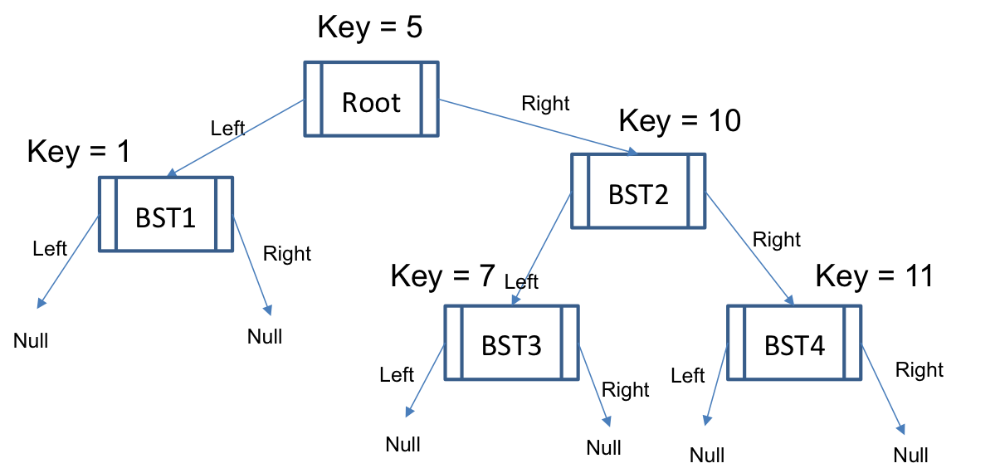

BSTElement<K,E> implements a _binary search tree element_ and is inherited from TreeElement<K,E>

## How does the BSTElement<K,E> work?

BSTElement<K,E> is a type of container that has two links that point to two child BSTElements. It uses the same conventions as the TreeElement<E>.

At this point, you may be wondering how a BSTElement<K,E> differs from a regular Binary Tree Element. The fundamental difference between the two classes is that the BSTElement<K,E> is used to build _search trees_, and holds an additional piece of data, the generic parameter K, called the "key". The key is used to enforce an ordering on the tree structure independent of the element that is being held.

A typical example would be a binary search tree where all of the keys of the left child are smaller than the keys of the right child.

Notice that the key for BST1 is smaller than the key for the root so it's to the left of the root. Also notice that the key for BST3 is smaller than the key for BST2, but larger than the key for the root. So BST3 sits on the left subtree of BST2, but in the right subtree of the Root.

- - -

## BSTElement - Example Using Earthquake Data

We will illustrate a binary search tree example that uses the BRIDGES API to retrieve 50 earthquake records (actually comes as Tweets) from USGS.gov. These will be inserted into a binary search tree, using the BSTElement elements. The quake magnitude will be used as the search key.

Java

C++

Python

### Bridges Visualization

-   Once all your code is in order, run your program.
-   Assuming all your code is correct and it compiles correctly, a link to the Bridges website will be generated.
-   Copy/paste this link into your favorite browser to view a visualization of the data structure you’ve just created.
-   It should look something like this:

<iframe src="https://bridges-cs.herokuapp.com/assignments/110/bridges_public">

Well done! You’ve just created your Bridges Binary Search Tree project!

w3IncludeHTML(); document.querySelector("\*.tabs > \*").click();