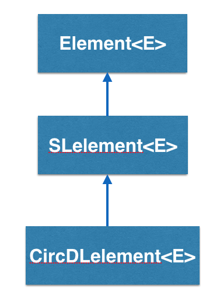
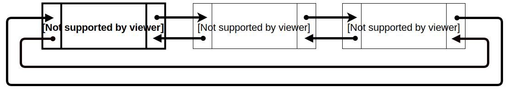

CircDLelement<E> implements a _circular doubly linked list_ element in BRIDGES and is inherited from DElement<E>

  

  ## How does the CircDLelement<E> work?

  CircDLelement<E> stands for Circular Doubly Linked Element, and is a container that has two links, pointing to two other doubly linked elements. So a CircDLelement<E> “knows” who it’s pointing at, AND it knows who pointed at it.

  

  In this example, calling getNext() on CircDLelement2 will return CircDLelement3. Calling getPrev() on CircDLelement2 will return CircDLelement1. CircDLelement3 points to CircDLelement1, and CircDLelement1 points to CircDLelement3.

  Notice that, since CircDLelement<E> has a getPrev() method, they can move forwards AND backwards through the linked elements.

  - - -

  ## CircDLelement - BRIDGES Example

  Java

  C++

  Python

  ### Bridges Visualization

  -   Once all your code is in order, run your file.
  -   Assuming all your code is correct and it compiles correctly, a link to the Bridges website will be generated on the console.
  -   Copy/paste this link into your favorite browser to view a visualization of the data structure you just created.
  -   It should look something like this:

  <iframe src="https://bridges-cs.herokuapp.com/assignments/106/bridges_public">

  Well done! You’ve just created your doubly linked circular list!