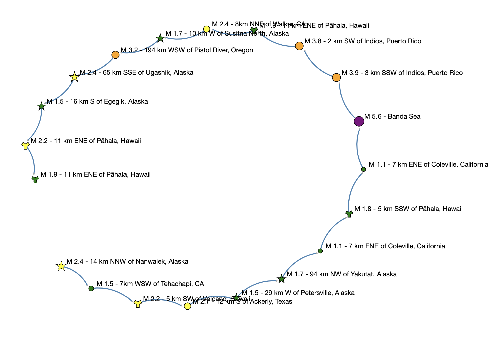

Assignment 2 - List Earthquake
========================

</img>

Goals
------
The purpose of this assignment is to learn to
1. Change the style of nodes.
2. Use the earthquake data.
You will generate a visualization that looks like the figure above.

### Programming part
### Task
Style a linked list of earthquake records.
### Node styling
1. Open your scaffold code.
2. Plug in your credentials.
3. All the styling will be done in `setProperties`.
4. Get the `EarthquakeUSGS` object from the `SLelement`.
5. Get the `ElementVisualizer` object from the `SLelement`.
6. Change the element size based on the earthquake magnitude.
7. Give the element a different shape if the earthquake is in Hawaii, and yet another shape if it is in Alaska.
### Help
#### For Java
[SLelement documentation](http://bridgesuncc.github.io/doc/java-api/current/html/classbridges_1_1base_1_1_s_lelement.html)

[Element documentation](http://bridgesuncc.github.io/doc/java-api/current/html/classbridges_1_1base_1_1_element.html)

[ElementVisualizer documentation](http://bridgesuncc.github.io/doc/java-api/current/html/classbridges_1_1base_1_1_element_visualizer.html)

[EarthquakeUSGS documentation](http://bridgesuncc.github.io/doc/java-api/current/html/classbridges_1_1data__src__dependent_1_1_earthquake_u_s_g_s.html)

#### For C++
[SLelement documentation](http://bridgesuncc.github.io/doc/cxx-api/current/html/classbridges_1_1datastructure_1_1_s_lelement.html)

[Element documentation](http://bridgesuncc.github.io/doc/cxx-api/current/html/classbridges_1_1datastructure_1_1_element.html)

[ElementVisualizer documentation](http://bridgesuncc.github.io/doc/cxx-api/current/html/classbridges_1_1datastructure_1_1_element_visualizer.html)

[EarthquakeUSGS documentation](http://bridgesuncc.github.io/doc/cxx-api/current/html/classbridges_1_1dataset_1_1_earthquake_u_s_g_s.html)

#### For Python
[SLelement documentation](http://bridgesuncc.github.io/doc/python-api/current/html/classbridges_1_1sl__element_1_1_s_lelement.html)

[Element documentation](http://bridgesuncc.github.io/doc/python-api/current/html/classbridges_1_1element_1_1_element.html)

[ElementVisualizer documentation](http://bridgesuncc.github.io/doc/python-api/current/html/classbridges_1_1element__visualizer_1_1_element_visualizer.html)
