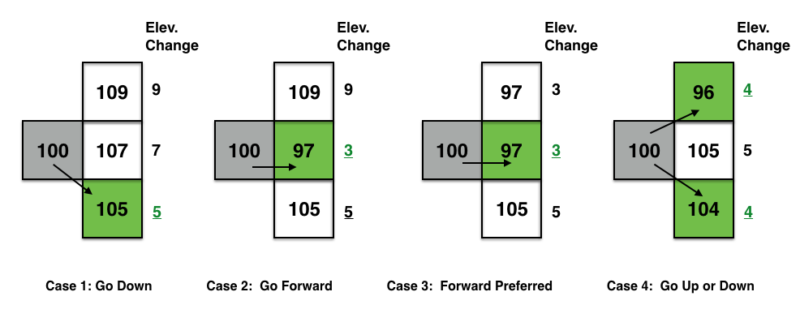

Mountain Paths - Determining a path of low elevation through a mountain
=======================================================================

## Goals

1. Working with 2D images of elevation maps
2. Understanding Greedy algorithms and its application to a real-world application
3. CS concepts: 2D array addressing, greedy algorithms

## Source
This assignment is adapted from a **[Nifty](http://nifty.stanford.edu/)  assignment 
from 2016 proposed by Baker Franke. See **[Source](http://nifty.stanford.edu/2016/franke-mountain-paths/)

## Description
You are given elevation data of a mountainous region in the form of a 2D array of integers 
(see example image below of one of the datasets). Your goal is to find a path that takes 
you through the points with the lowest elevation changes, in an effort to minimize the 
overall effort in walking through the path. For this you will use a `greedy' approach and 
make local decisions in determining the successive points in the path.

Input gray scale image of a terrain with  gray shades mapped to elevation. Elevation ranges from low (dark shades) to high (lighter shades)

The image above shows a mountainous region; lighter regions are higher elevation, 
and the red line shows the path taken by a walker.

 
### Algorithm To Determine the Path:

The figure above (reproduced from **[Nifty](http://nifty.stanford.edu/)) illustrates 4
different cases for making a decision in determining the next point in the path.

You will use a greedy strategy to determine successive points along the path. 
Figure above shows how the algorithm applies the greedy strategy to a pixel (with 
grayscale values shown). The algorithm looks to the 3 choices and picks the pixel that  
causes the smallest change (least effort to walk).  The idea is to start from an edge 
of the image (say the leftmost column), then make moves based on the pixels to the right, 
each time choosing the pixel that results in the smallest change. Your goal is to reach 
the right edge of the image.

 

## Tasks

1. *get dataset, visualize as an image* You will use BRIDGES to define a lat/long range (rectangular bounding box of your choice) to access the elevation data (returned in an object
containing the elevation values).  You will need to calculate maximum elevation value, as you 
will need to scale the values to the (0-255) range to display the image in a ColorGrid. 
(Backup plan is to read from a PPM image, if there are any issues accessing data from
an external source)

2.  *Display the image using BRIDGES.* Once you have acquired the dataset,
scale the values to 0-255 range and convert that to an integer (divide each value 
by the largest and scale to 255). Use the BRIDGES ColorGrid class to hold the image. 
This can then  be visualized directly in BRIDGES. Check the tutorial for the ColorGrid
object that illustrates the calls needed  for visualization. The ColorGrid class has the 
methods to load colors for each pixel and can take separate R,G, B and Alpha components.
For grayscale images (like the one above), R=G=B.

3.	*Compute the Lowest Elevation Path.* Implement the greedy algorithm on the image.  
Choose a pixel in the left most column, somewhere in the middle region.  Your program 
will determine the points in the path that exhibit the smallest change (see figure above) 
in elevation and draw this path in a distinct color (like red). Pixels in the path will 
have their values changed to this color (for instance, use (255, 0, 0) for red.  
As you compute these low elevation points, modify your color grid to draw the red pixels.  
You need to keep track of the pixel addresses and the image height and width, so that you 
dont go past the boundaries of  the dataset (grid). Note that if you are on the boundaries
of the grid, your choices will be reduced.

4. *Display the image.*  Again, use BRIDGES to display your final image with the chosen 
path (see example above). You can have a simple User Interface to specify the starting 
point and rerun your program to display different paths.

## Variants

One can make variants of this assignment. Indeed, the greedy
algorithm presented above is a heuristic; it does not return the path
that sees the lowest change of elevation across the entire mountain. It only makes a 
local choice. Here are some possibilities:

1. One can find the path that always goes right and that minimizes the total change of 
	elevation using Dynamic Programming. Propose a Dynamic Programming algorithm, 
	and implement it to highlight the right-going path of minimal total change of 
	elevation.

2. If one does not always go right, then the problem is akin to a Shortest Path problem. 
	Adapt Dijkstra's algorithm and implement it to highlight the path of least change of 
	elevation.

3. Graduate students can consider the problem of optimizing simultaneously the distance 
	traversed and the total change of elevation as a bi objective optimization problem.

## Additional Help:

[BRIDGES Team:](http://bridgesuncc.github.io/) Contact the BRIDGES team for any 
issues with the BRIDGES API. This is an active project.

#### for Java

[ElevationData Documentation](http://bridgesuncc.github.io/doc/java-api/current/html/classbridges_1_1data__src__dependent_1_1_elevation_data.html)

[DataSource](http://bridgesuncc.github.io/doc/java-api/current/html/classbridges_1_1connect_1_1_data_source.html)

[ColorGrid documentation](http://bridgesuncc.github.io/doc/java-api/current/html/classbridges_1_1base_1_1_color_grid.html)

[Color documentation](http://bridgesuncc.github.io/doc/java-api/current/html/classbridges_1_1base_1_1_color.html)

[Bridges class documentation](http://bridgesuncc.github.io/doc/java-api/current/html/classbridges_1_1connect_1_1_bridges.html)

#### for C++
[ElevationData Documentation](http://bridgesuncc.github.io/doc/cxx-api/current/html/classbridges_1_1dataset_1_1_elevation_data.html)

[DataSource](http://bridgesuncc.github.io/doc/cxx-api/current/html/classbridges_1_1_data_source.html)

[ColorGrid documentation](http://bridgesuncc.github.io/doc/cxx-api/current/html/classbridges_1_1datastructure_1_1_color_grid.html)

[Color documentation](http://bridgesuncc.github.io/doc/cxx-api/current/html/classbridges_1_1datastructure_1_1_color.html)

[Bridges Class documentation](http://bridgesuncc.github.io/doc/cxx-api/current/html/classbridges_1_1_bridges.html)

#### for Python

[Elevation Data Documentation](http://bridgesuncc.github.io/doc/python-api/current/html/classbridges_1_1data__src__dependent_1_1elevation_1_1_elevation_data.html)

[ColorGrid documentation](http://bridgesuncc.github.io/doc/python-api/current/html/classbridges_1_1color__grid_1_1_color_grid.html)

[Color documentation](http://bridgesuncc.github.io/doc/python-api/current/html/classbridges_1_1color_1_1_color.html)

[Bridges documentation](http://bridgesuncc.github.io/doc/python-api/current/html/classbridges_1_1bridges_1_1_bridges.html)

[DataSource](http://bridgesuncc.github.io/doc/python-api/current/html/data__source_8py.html)
