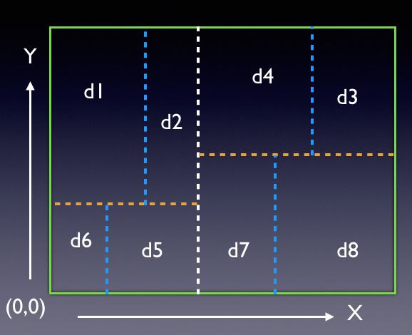
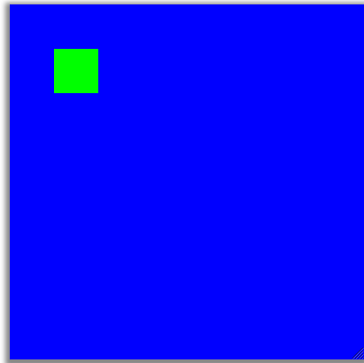

Representing and Compressing Images Using K-D Trees
===================================================

## Goals
1. Work with and manipulate binary search trees; here we use a spatial search tree, which is 
	similar to quadtree or octree.
2. Introduce students to images, their representation and compression using approximate
	representations.
3. Introduce students to BRIDGES Tree hierarchy, use of inheritance and polymorphism

## Background

K-D trees (K stands for the number of dimensions) are a spatial equivalent  of the more familiar 
binary search trees, that usually have integer keys to facililtate efficient (log n) search). 
K-D trees  belong to the class of spatial search  tree structures, that include quadtrees, 
octrees, etc. These structures are used to represent geoemtrically defined  spaces. In a 2 
dimensional K-D tree (K = 2), we start with a 2D rectangular region and each step divides the space 
up into 2 regions using a *partitioning line*, that is usually axis-aligned  (horizontal 
or vertical).  This is done recursively, i.e., the subdivided regions are further subdivided 
until a certain termination criterion is satisfied. See the following figure that illustrates 
a 3 level partitioning:

*Illustrates a 3-level K-D tree partitioning applied to a 2D region and teh resulting binary tree.*

*Illustrates a 2D region's partitioning with horizontal (X) and vertically (Y) oriented partitioners* 

In the figures above, a 2D region is being partitioned. The first partitioner is the white line that goes across the region, dividing it into two subregions (these become children of the root node of the tree. At the next level, the yellow lines partition the two subregions creating two of their own children each. Finally the blue lines subdivide at the third level. Each region can contain data (di s) that can be  points or other information that can then be searched for efficiently knowing the location of the partitioning lines.

## Example

*Application of K-D Trees to representing a shape. Here the green square (left image)  is a 
simple shape being approximated by a 2D  K-D tree representation. Note the adaptive partitioning, 
i.e., only regions near the cube boundary are partitioned, while the homogeneous (large blue) 
(or the interior cube) regions are not. Regions that are homogeneous are not partitioned and become leaf  nodes of the tree.*

The above figures contain a small green square inside a blue background.  The left image is the 
original image and the right image is a K-d Tree representation of the same image. The white lines 
in the bottom image represent the partitioning lines. Notice that this representation  is 
approximate, since the image itself is represented by the leaf nodes (which are all 
rectangles of varying size) of the tree. In other words, the K-D tree chops up the original 
image rectangle into a set of  smaller sized rectangular regions  to represent the image.  
The entire image is now  represented by the tree with enough information (leaf nodes will have 
the region geometry and its color) to generate the image.

Applications: Refer to the Wikipedia page on **[K-D trees](https://en.wikipedia.org/wiki/K-d_tree)**  for additional information  and applications.

## Project

You will use the  K-D TreeElement class structure as a subclass of the BinTreeElement defined in 
BRIDGES. You will use this structure along with the ColorGrid type to represent 
images using K-D Trees.

### Tasks:

1.  *Preparation:* 
	1. Go through the BRIDGES API for both the **[K-D Tree Element](http://bridgesuncc.github.io/doc/cxx-api/current/html/classbridges_1_1_kd_tree_element.html)** and 
	the **[ColorGrid](http://bridgesuncc.github.io/doc/cxx-api/current/html/classbridges_1_1_color_grid.html)** types and look at the tutorial examples to understand its usage.  In particular, understand 
the class hierarchy for tree structures (Java and Python users: check the Java or Python API for these class defintions in BRIDGES).
	2. Go through the K-D Tree and ColorGrid tutorials in BRIDGES and build these and ensure you 
		get the same visualizations.
	3. [Optional] To get a better understanding of the K-D tree element, develop your own 
		version of this class and inherit it from the BinTreeElement and ensure it works.

2.  Now that you are comfortable with K-D Trees and Color grids, you are ready to 
	implement this project. To  represent images using the Kd Tree, we will use the 
	ColorGrid structure in BRIDGES to hold an image. Sample images will be provided. 
	The general idea  of representing images using a spatial structure is to  subdivide the 
	image region adaptively, i.e., focusing higher amounts of subdivision in areas of more 
	detail/complexity, so as to get a more accurate representation.  You will develop this 
	application in two stages:
	1.  *Partition the region and display the partitioning lines:*
	2.  Develop tests for homogeneity of a region and use that to terminate the subdivision or 
		if the region becomes smaller than a fixed size.

3.  *Output:* Your application will display (using BRIDGES) both the  original images and the 
	KD tree representation of the image (including the partitioning lines). 
4.  *Testing:* Test your implementation with various images, for instance, yourself, your pet or 
	anything that personalizes this project for you. Play with the representation level (of the 
	tree) and generate a series of images of increasing detail.

#### PseudoCode for K-D Tree Representation of Image:

	KdTreeElement<int, string> *buildImageTree (
		int *region,    // region - xmin, ymin, xmax, ymax
		int level,      // level of the tree, starts at 0 for root
		ColorGrid *cg   // the region - originally the entire image
		bool dim_flag) {// partitioning dimension, will flip with each
		// create a kd tree element 
		KdTreeElement<int, int> *root = new KdTreeElement<int, int>(.....)

		// check the region's homogeneity
		bool homogeneous = IsRegionHomogeneous(....);

		if ((level < MaxLevel) && !homogeneous) {   // partition 
			if (!dim_flag){     
				// partition on X
				// choose a partioning value between xmin and xmax
				partition = partition(.... )
		
				// form the two partitioned regions, left and right
				int lregion[] = ...
				int rregion[] = ...

				// recurse
				root->setLeft(buildImageTree (.....);
				root->setRight(buildImageTree (.....);
			}
			else {              
				// partition on Y
				// ditto... for partitioning on the Y dimension, similar to X but regions
				// will be bottom and top regions

			}
			// color the partitioning line, in white, so
			// we can see the adaptive kd tree partitioning of 
			// the image first form the partitioned region, 
			// depending on the partitioning dimension      
			// treat it as a thin region of width 2 or 3 pixels, so
			// its clearly visible
			int partitioned_region[] = {.....}

			// color the region - similar to the color grid in Module 1
			ColorRegion ( ......, "white"...)

			return root;
		}
		// region is homogeenous, color it using the average
		// color of the region (compute avg in r, g, b separately
		ColorRegion (cg, region);

		return nullptr;
	}

### Region Homogeneity:

We need to be able to compute how homogeneous a region is before
deciding to partition that region. You will write two versions of this function

*IsRegionHomogeneous ()*

which takes in  a region (which is defined by a box - ranges in X and Y - within the image) 
and checks to see if the colors are homogeneous within a threshold. Consider the following 2
strategies:

1. In this simpler version (works only on 2 color images), you simply have to see if there 
are two pixels of different colors to determine a region to be not homogeneous, 
else it is homogeneous. Terminate if you find the region heterogenous and continue with the
partitioning

2. Use the following algorithm: first sum the colors (for each of the red, green and 
blue components) and compute the average red, blue and green colors for the region. Next 
iterate through the region's pixels and compare each R, G, B value to the average. 
If any of the differences are above a set threshold, then the region is not homogeneous 
and return false, else return true.  

#### Other Constants
1. *Max levels:* Notice that there is a constant called Max_Levels - this is used to limit 
	amount of partitioning (height of the KD tree). The level variable should be incremented 
	when you recurse and the recursion will terminate if the max levels is reached.

2. *Partitioner:* Write a function that will return a partitioning value between the region's 
	min and max values in that dimension. For instance, the region's X values are within  
	10  to 50, then pick a value between the two at random; to avoid very thin regions, 
	pick a value between first and the second third (between (10+40/3,  50-40/3).  If the region 
	width (max-min)  is less than  3, then return true (homogeneous) to avoid degenerate cases).

### Visualization:

Note that we are using the ColorGrid type to fill the image with the region colors (r, g and b), 
so that we can visualize it with BRIDGES.  Follow the Colorgrid tutorials for filling in regions
with the computed colors (as required by the ColorRegion() function above).

### Extensions
The project can be extended in a number of ways to reinforce tree structures and explore 
applications:

1. Implement the project with a quadtree representation; define a QuadtreeElement and derive it from
	a BRIDGES class (for instance, the QuadtreeElement could be inherited from the Kd-tree with
	fixed partitioners.
2. Compression: Use the K-d tree representation of the image and encode/decode the image from the
	tree representation. For instance, you can use a preorder traversal of the tree for the
	encoding and to facilitate reconstruction of the tree, if needed. Compute the compression
	factor.
3. Consider using other methods for homogeneity that might be more optimal from a compression 
	perspective.

## Help
[BRIDGES Team:](http://bridgesuncc.github.io/) Contact the BRIDGES team for any issues with 
the BRIDGES API. This is an active project.

#### for C++

[K-D Tree Element documentation](http://bridgesuncc.github.io/doc/cxx-api/current/html/classbridges_1_1_kd_tree_element.html)

[ColorGrid documentation](http://bridgesuncc.github.io/doc/cxx-api/current/html/classbridges_1_1_color_grid.html)

[Color documentation](http://bridgesuncc.github.io/doc/cxx-api/current/html/classbridges_1_1_color.html)

[Bridges documentation](http://bridgesuncc.github.io/doc/cxx-api/current/html/classes.html)

#### for Java
[K-D Tree Element documentation](http://bridgesuncc.github.io/doc/java-api/current/html/classbridges_1_1base_1_1_kd_tree_element.html)

[ColorGrid documentation](http://bridgesuncc.github.io/doc/java-api/current/html/classbridges_1_1base_1_1_color_grid.html)

[Color documentation](http://bridgesuncc.github.io/doc/java-api/current/html/classbridges_1_1base_1_1_color.html)

[Bridges class documentation](http://bridgesuncc.github.io/doc/java-api/current/html/namespacebridges_1_1base.html)

#### for Python

[K-D Tree Element documentation](http://bridgesuncc.github.io/doc/python-api/current/html/classbridges_1_1kd__tree__element_1_1_k_d_tree_element.html)

[ColorGrid documentation](http://bridgesuncc.github.io/doc/python-api/current/html/classbridges_1_1color__grid_1_1_color_grid.html)

[Color documentation](http://bridgesuncc.github.io/doc/python-api/current/html/classbridges_1_1color_1_1_color.html)

[Bridges documentation](http://bridgesuncc.github.io/doc/python-api/current/html/classbridges_1_1bridges_1_1_bridges.html)
