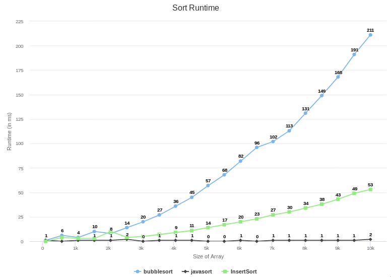

Sorting Benchmark
=================

Goal
----

Understand the performance of sorting algorithms by implementing and benchmarking them.

Task
----

We will be sorting arrays of integers

1. Implement two quadratic sorting algorithms.
2. Implement two efficient sorting algorithms.
3. Benchmark the four algorithms against the standard sorting algorithm provided in the standard library, at small scale and at medium scale.

Sample Output
-------------

Documentation
-------------
