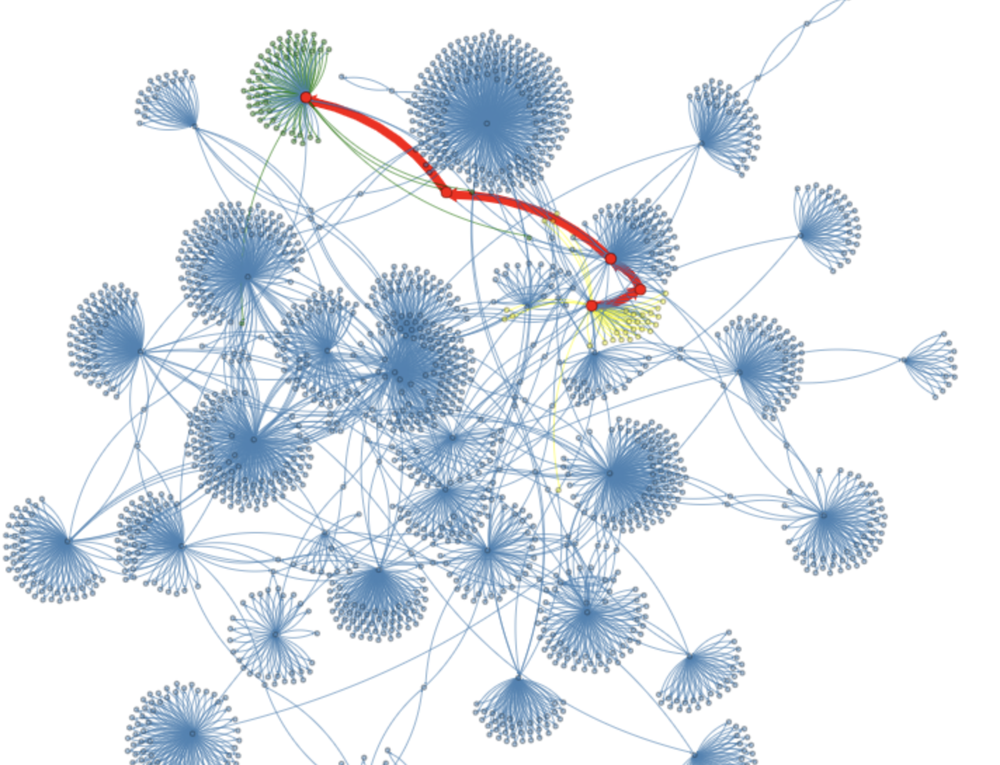

Assignment 3 - Graph Bacon Number
=================================

</img>


Goals
-----

The purpose of this assignment is to learn to

1. Use the IMDB Actor Movie graph.
2. Compute BFS on that graph.
3. Highlight a shortest path in the graph.

You will generate a visualization that looks like the figure above.

Programming part
----------------

### Task

Highlight the shortest path between two actors in a Movie Actor graph.

### Getting Started

1. Open your scaffolded code.
2. Plug in your credentials.
3. Change the style of nodes Cate_Blanchett and Kevin_Bacon_(I), directly attached nodes, and directly attached edges.
4. Compile, run, and visualize.

### Perform BFS

1. Write a BFS traversal in `getBaconNumber` that keeps track of parent information. Here is the algorithm:

```algorithm
BFS(G=(V,E), root)
  forall v in V
    mark[v] = false;
  mark[root] = true;
  queue.push(root);
  while (! queue.empty() )
    v = queue.pop();
    for (u in neighboor(v))
      if (mark[u] == false)
        mark[u] = true;
	parent[u] = v;
```

2. We recommend using a built-in associative array for storing parents, such as Java's `HashMap` or C++'s `std::unordered_map`.
3. We recommend using a built-in queue, such as Java's `ArrayDeque` or C++'s `std::queue`.

### Style the BFS path

1. Start from the Cate_Blanchett node.
2. Color the current node red and make it bigger.
3. Style the edge from the current node to its parent. Make it red and bigger.
4. Go to the parent node and go back to 2 until Kevin_Bacon_(I) has been reached.

### Help

#### for Java

[ArrayDeque documentation](https://docs.oracle.com/javase/7/docs/api/java/util/ArrayDeque.html)

[HashMap documentation](https://docs.oracle.com/javase/8/docs/api/java/util/HashMap.html)

[Element documentation](http://bridgesuncc.github.io/doc/java-api/current/html/classbridges_1_1base_1_1_element.html)

[GraphAdjListSimple documentation](http://bridgesuncc.github.io/doc/java-api/current/html/classbridges_1_1base_1_1_graph_adj_list_simple.html)

[ElementVisualizer documentation](http://bridgesuncc.github.io/doc/java-api/current/html/classbridges_1_1base_1_1_element_visualizer.html)

[LinkVisualizer documentation](http://bridgesuncc.github.io/doc/java-api/current/html/classbridges_1_1base_1_1_link_visualizer.html)

[ActorMovieIMDB documentation](http://bridgesuncc.github.io/doc/java-api/current/html/classbridges_1_1data__src__dependent_1_1_actor_movie_i_m_d_b.html)

#### for C++

[std::queue documentation](http://en.cppreference.com/w/cpp/container/queue)

[std::unordered_map documentation](http://en.cppreference.com/w/cpp/container/unordered_map)

[Element documentation](http://bridgesuncc.github.io/doc/cxx-api/current/html/classbridges_1_1datastructure_1_1_element.html)

[GraphAdjList documentation](http://bridgesuncc.github.io/doc/cxx-api/current/html/classbridges_1_1datastructure_1_1_graph_adj_list.html)

[ElementVisualizer documentation](http://bridgesuncc.github.io/doc/cxx-api/current/html/classbridges_1_1datastructure_1_1_element_visualizer.html)

[LinkVisualizer documentation](http://bridgesuncc.github.io/doc/cxx-api/current/html/classbridges_1_1datastructure_1_1_link_visualizer.html)

[ActorMovieIMDB documentation](http://bridgesuncc.github.io/doc/cxx-api/current/html/classbridges_1_1dataset_1_1_actor_movie_i_m_d_b.html)

#### for Python

[Queue documentation](https://docs.python.org/3/library/queue.html)

[Element documentation](http://bridgesuncc.github.io/doc/python-api/current/html/classbridges_1_1element_1_1_element.html)

[GraphAdjList documentation](http://bridgesuncc.github.io/doc/python-api/current/html/classbridges_1_1graph__adj__list_1_1_graph_adj_list.html)

[ElementVisualizer documentation](http://bridgesuncc.github.io/doc/python-api/current/html/classbridges_1_1element__visualizer_1_1_element_visualizer.html)

[LinkVisualizer documentation](http://bridgesuncc.github.io/doc/python-api/current/html/classbridges_1_1link__visualizer_1_1_link_visualizer.html)
