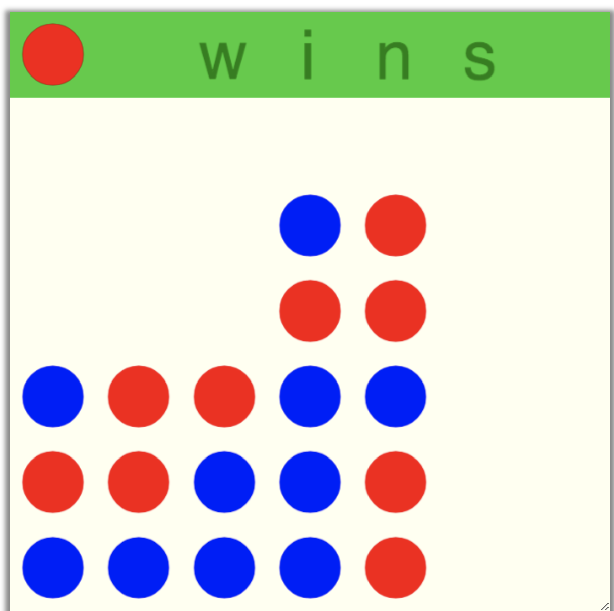

# Connect Four

## Goals

The purpose of this assignment is to learn to

1. Use booleans to create a 2-player game.
2. Use loops, 2D arrays, and conditional statements to drop pieces onto the grid and check if four of the same color have connected.

## Programming

### Tasks

- Initialize a 2D array the size of your game grid
- Determine which player will go first
- Create a function that uses keypress events to move the game piece around
- Create a function that handles player turns
- Create functions that check for the win condition
- Create a win condition
- Create a tie condition
- Correctly handle edge cases

## More Details to Get You Started

### Key Press Events - NonBlocking Games

- keyUp()
- keyDown()
- keyLeft()
- keyRight()

### Variables, Colors, and Sprite Symbols

- NamedSymbol.symbolname;
- NamedColor.colorname;
- drawSymbol(column, row, NamedSymbol, NamedColor);
- setBGColor(column, row, NamedColor);

### Important Functions

- The gameLoop() function loops until the win condition has been met (or there is a tie).
- quit() stops the game
- start() starts the game and calls the initalize function once before starting the gameLoop()

### Help

#### Java

[NonBlocking Games Documentation](http://bridgesuncc.github.io/doc/java-api/current/html/classbridges_1_1games_1_1_non_blocking_game.html)

[NamedColor Documentation](http://bridgesuncc.github.io/doc/java-api/current/html/enumbridges_1_1base_1_1_named_color.html)

[NamedSymbol Documentation](http://bridgesuncc.github.io/doc/java-api/current/html/enumbridges_1_1base_1_1_named_symbol.html)

#### C++

[NonBlocking Games Documentation](https://bridgesuncc.github.io/doc/cxx-api/current/html/classbridges_1_1game_1_1_non_blocking_game.html)

[NamedColor Documentation](https://bridgesuncc.github.io/doc/cxx-api/current/html/namespacebridges_1_1game.html#afaa832a4322b25b6a4ebfba832f10f26)

[NamedSymbol Documentation](https://bridgesuncc.github.io/doc/cxx-api/current/html/namespacebridges_1_1game.html#ab9a19c7ab6e2ebac2f95180e21733487)

#### Python

[NonBlocking Games Documentation](https://bridgesuncc.github.io/doc/python-api/current/html/classbridges_1_1non__blocking__game_1_1_non_blocking_game.html)

[NamedColor Documentation](https://bridgesuncc.github.io/doc/python-api/current/html/classbridges_1_1named__color_1_1_named_color.html)

[NamedSymbol Documentation](https://bridgesuncc.github.io/doc/python-api/current/html/classbridges_1_1named__symbol_1_1_named_symbol.html)

