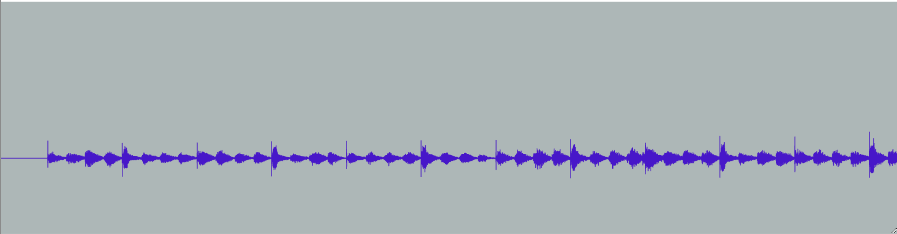
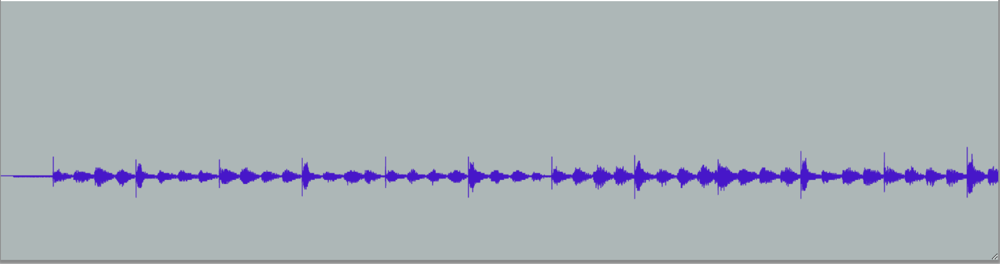

# 37 - Subsampling Bit Depth

## Example Images

</img>

</img>

## Goals

 - Declaration of variables
 - Function calls
 - File I/O

Audio is made up of values telling speakers that play the audio how far to move in one of two directions. Bit depth tells you how many different possible values the audio can have at any specific point, ie -2.147B to 2.147B for 32 bit audio. Thats a ton of values! Even in 8 bit audio, the values range from -32k to 32k. 

When converting audio using code, converting those 2B values to 32k values can be done in a couple ways. For this assignment, we convert the numbers to binary (2^x instead of 10^x). If you want to read up on how binary works, please check the help section. Once in binary, we lose the numbers to the left until we have only x possible values. 

For an example in our base, we have 10,247,654. We want to transform this so it can fit within a 10k number range while. We lose the 1024 in the front so the value is 7,654. What this does is basically combine 1024 possible values into 1, closest together.

How we convert bitdepth is rudimentary at best, but for audio it works just fine. You can hardely tell the difference between audioclips once transformed. Most audio you listen to is actually 24 or 16 bit audio, Youtube even uses this! Quality is not much of an issue, but the most noticable problem can come from white noise. Values close to 0 can be given more of an impact when converted to 8 bit, creating some noise when it wasn't supposed to appear. You'll notice this when you visualize the assignment!

## Description

In this assignment, students will process audio by changing the sampling rate and bit depths for subsampling the audio file.  Students will declare variables for sampling count (How many samples are taken per second) and bit depth. They will pass them to methods that visualizes the result.

### TASKS
1. pass credentials to the bridges object
2. Initialize a instance of the bitdepth class
3. Create a AudioClip object for the 32-bit audio
4. Pass the AudioClip and desired bit depth to the conversion() method of the class for getting 24-bit, 16-bit, and 8-bit audio
5. for every AudioClip object, pass it to bridges.setDataStructure, then immediatly call bridges.visualize()

## Extensions
- Remove scaffolding of the methods, and get the students to visual the data directly using arrays

## Help

### For C++

[AudioClip Documentation](https://bridgesuncc.github.io/doc/java-api/current/html/classbridges_1_1base_1_1_audio_clip.html)

### For Java

[AudioClip Documentation](https://bridgesuncc.github.io/doc/java-api/current/html/classbridges_1_1base_1_1_audio_clip.html)

### For Python

[AudioClip Documentation](https://bridgesuncc.github.io/doc/python-api/current/html/classbridges_1_1audio__clip_1_1_audio_clip.html)
