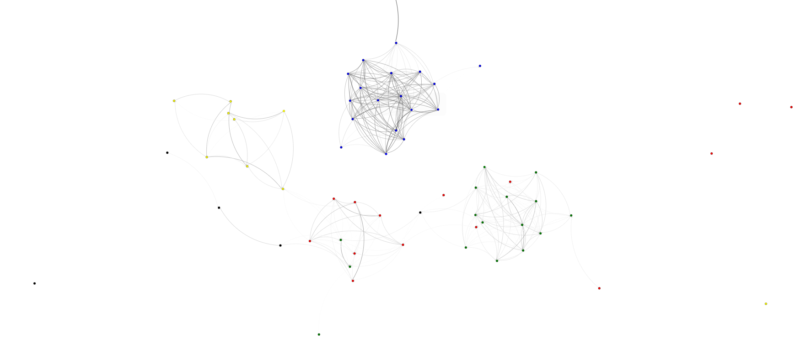

Book Distance through Text Analysis
=====================================

Goals
-----

Implement a word frequency list for a book and use it to compare similarity to other books.

Tasks
-----

1. Get book meta data information using Bridges API: DataSource.getGutenbergMetaData()

2. With the meta data, get the books by ID using Bridges API: DataSource.getGutenbergBookText()

3. Generate a word frequency list with the book text

4. Compare two frequency lists to determine the similarity between book texts. Can use a L1 Norm comparison. 

5. Generate a graphadjlist using the similarity values and book nodes.

Example output
--------------

Varients
--------

One can change the complextiy of the comparison algorithm to one that is L2 Norm (Euclidean Distance)
or even L3 Norm.

How did you display the similarity value? One can switch up the visual aspect 
of the assignment to convey different meanings. You can display a 

Changing the dataset used for this comparison could be a good way to get more 
engagement in the assignment. Using song lyrics is a good alternative to 
the gutenberg data.

### Help
#### For C++
[Bridges documentation](http://bridgesuncc.github.io/doc/cxx-api/current/html/classbridges_1_1_bridges.html)

[GraphAdjList documentation](http://bridgesuncc.github.io/doc/cxx-api/current/html/classbridges_1_1datastructure_1_1_graph_adj_list.html)

[GutenbergData documentation](https://bridgesuncc.github.io/doc/cxx-api/current/html/classbridges_1_1dataset_1_1_gutenberg_book.html)

[DataSource documentation](http://bridgesuncc.github.io/doc/cxx-api/current/html/classbridges_1_1_data_source.html)

#### For Java

[Bridges documentation](http://bridgesuncc.github.io/doc/java-api/current/html/classbridges_1_1connect_1_1_bridges.html)

[GraphAdjList documentation](http://bridgesuncc.github.io/doc/java-api/current/html/classbridges_1_1base_1_1_graph_adj_list.html)

[GutenbergData documentation](https://bridgesuncc.github.io/doc/java-api/current/html/classbridges_1_1data__src__dependent_1_1_gutenberg_meta.html)

[DataSource documentation](http://bridgesuncc.github.io/doc/java-api/current/html/classbridges_1_1connect_1_1_data_source.html)

#### For Python

[Bridges documentation](http://bridgesuncc.github.io/doc/python-api/current/html/classbridges_1_1bridges_1_1_bridges.html)

[GraphAdjList documentation](http://bridgesuncc.github.io/doc/python-api/current/html/classbridges_1_1graph__adj__list_1_1_graph_adj_list.html)

[GutenbergData documentation](http://bridgesuncc.github.io/doc/python-api/current/html/classbridges_1_1data__src__dependent_1_1osm_1_1_osm_data.html)

[DataSource documentation](https://bridgesuncc.github.io/doc/python-api/current/html/namespacebridges_1_1data__src__dependent_1_1data__source.html)