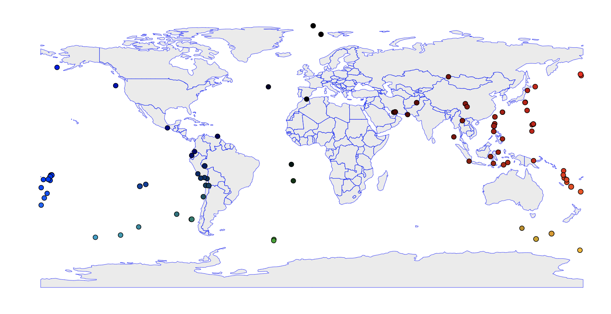

# Earthquake Tracker

## Example Output

</img>

## Learning Outcomes

1. Data Visualization
2. Graph Traversal
3. Sorting
4. Conditions

## Goals

The purpose of this assignment is to learn to
1. Access and manipulate remote data through BRIDGES.
2. Manipulate a `GraphAdjList` object.
3. Display a location on a map.
4. Optionally, perform basic graph operation (connected component)

You will be building a visualization that looks like in the figure above.

## Description

### Task
Grab recent earthquake data and build a graph representing the
locations of the 100 strongest earthquakes.

### Basic
1. Open your scaffolded code.
2. Plug in your credentials.
3. Get the most recent 10,000 earthquakes.
4. Only retain the 100 highest magnitude earthquakes.

### Place Earthquakes on the map
1. Create a graph where each earthquake is a vertex.
2. Add no edges for now.
3. Pin earthquakes at their longitude and latitude.
4. Tweak the appearance of vertices if you want (e.g., use a different symbols for earthquake in Hawaii or Alaska).
5. Compile, run, and visualize.

### Build a graph based on distances
1. For each pair of earthquakes:
   1. Compute the distance using `calcDistance`.
   2. If the earthquakes are closer than 500km, add an edge between them.
2. Compile, run, and visualize.

### Show just the graph
1. Deactivate the map overlay (already done in the scaffolding).
2. Unpin the vertices by setting their location to infinity.
3. Compile, run, and visualize.

### (Optionally) Compute connected component
1. unmark all vertices
2. find an unmarked vertex
3. flood its component and color its vertices
4. go back to 2 as long as there are unmarked vertices
5. Compile, run, and visualize.

## Extensions

## Help

#### For Java
[Element documentation](http://bridgesuncc.github.io/doc/java-api/current/html/classbridges_1_1base_1_1_element.html)

[GraphAdjListSimple documentation](http://bridgesuncc.github.io/doc/java-api/current/html/classbridges_1_1base_1_1_graph_adj_list_simple.html)

[GraphAdjList documentation](http://bridgesuncc.github.io/doc/java-api/current/html/classbridges_1_1base_1_1_graph_adj_list.html)

[ElementVisualizer documentation](http://bridgesuncc.github.io/doc/java-api/current/html/classbridges_1_1base_1_1_element_visualizer.html)

[EarthquakeUSGS documentation](http://bridgesuncc.github.io/doc/java-api/current/html/classbridges_1_1data__src__dependent_1_1_earthquake_u_s_g_s.html)

[Bridges class documentation](http://bridgesuncc.github.io/doc/java-api/current/html/namespacebridges_1_1base.html)

#### For C++
[Element documentation](http://bridgesuncc.github.io/doc/cxx-api/current/html/classbridges_1_1datastructure_1_1_element.html)

[GraphAdjList documentation](http://bridgesuncc.github.io/doc/cxx-api/current/html/classbridges_1_1datastructure_1_1_graph_adj_list.html)

[ElementVisualizer documentation](http://bridgesuncc.github.io/doc/cxx-api/current/html/classbridges_1_1datastructure_1_1_element_visualizer.html)

[EarthquakeUSGS documentation](http://bridgesuncc.github.io/doc/cxx-api/current/html/classbridges_1_1dataset_1_1_earthquake_u_s_g_s.html)

[DataSource documentation](http://bridgesuncc.github.io/doc/cxx-api/current/html/classbridges_1_1_data_source.html)

### For Python
[Element documentation](http://bridgesuncc.github.io/doc/python-api/current/html/classbridges_1_1element_1_1_element.html)

[GraphAdjList documentation](http://bridgesuncc.github.io/doc/python-api/current/html/classbridges_1_1graph__adj__list_1_1_graph_adj_list.html)

[ElementVisualizer documentation](http://bridgesuncc.github.io/doc/python-api/current/html/classbridges_1_1element__visualizer_1_1_element_visualizer.html)

[EarthquakeUSGS documentation](http://bridgesuncc.github.io/doc/python-api/current/html/classbridges_1_1data__src__dependent_1_1earthquake__usgs_1_1_earthquake_u_s_g_s.html)

[LinkVisualizer documentation](http://bridgesuncc.github.io/doc/python-api/current/html/classbridges_1_1link__visualizer_1_1_link_visualizer.html)
