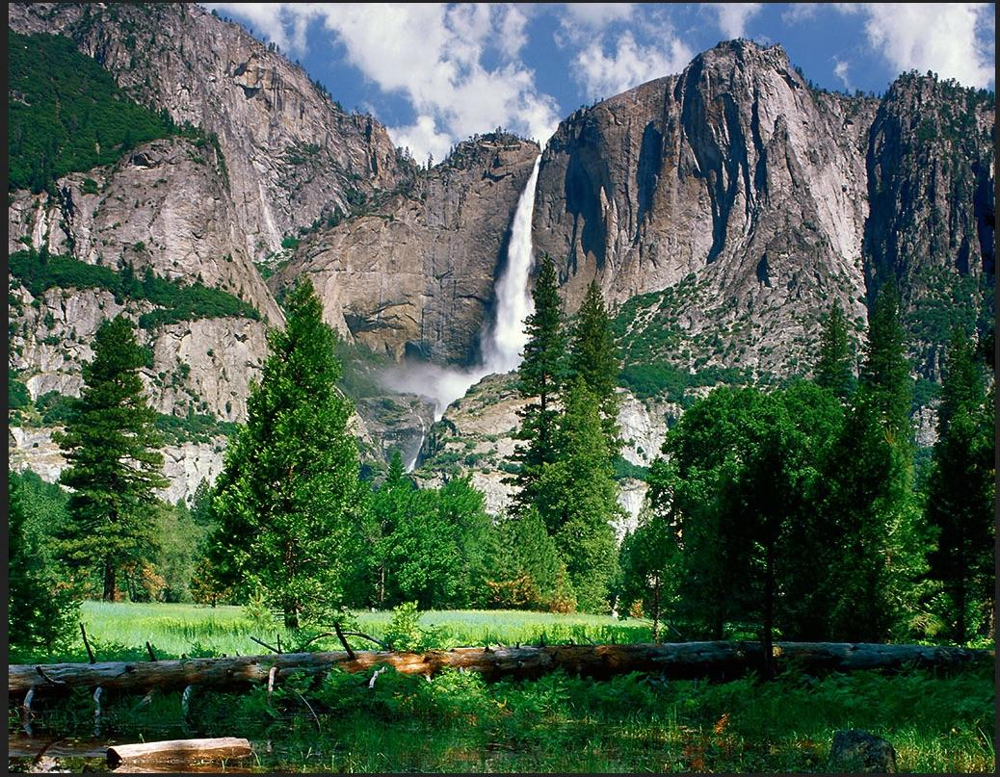

# Processing 2D Images - 40

## Example Images

 

 ## Goals

1. Working with 2D images.
2. Implementing simple operations on images, such as color manipulation, 
	filtering.
3. CS concepts: 2D array addressing, processing

## Description
Students are provided with sample images in a simple text format (eg., PPM) 
that they read and display using the ColorGrid datatype (an abstraction for 
images). Students are asked to perform a number of simple processing 
operations on the provided input images, such as the one given above. 

Students are provided with a skeleton of an Image class that they will use
to implement the required image processing operations listed below.
 
### Tasks

1. **Read Input Image.** You will read images in PPM (text) format, with all 
	of the data in pure text form. This is a simple format with a header 
	containing 4 values: A magic number, width, height and maxVal,  maxVal 
	representing the maximum of the pixel values, which is useful for 
	scaling when the image values are in a larger range. This is followed 
	by a  sequence of RGB triplets. Each pixel is thus represented by 3 
	integer values. For instance, (255, 0, 0) is red at full  intensity.
	Sample images are provided. See  Testing pages.  
2. **Display Image.** You will use BRIDGES to display the image by storing it in
	a ColorGrid object.
3. **Image Processing.**

	 * **toGrayScale.** This method will convert the original RGB PPM image into a 
		*grayscale image.*  You can use the following conversion formula: 

			grayVal  = 0.299R + 0.587G + 0.114B

		where R,G, B are the red, green and blue color components. To display 
		the grayscale image as a PPM image, use the gray value for all 3 
		components,  for example, (128, 128, 128) is gray value midway through 
		the range.

	 * **flipHorizontal.** This function will simply flip the pixels in each 
		row horizontally. In other words, pixel 0 on the row is exchanged 
		with pixel (n-1),  pixel 1 with pixel (n-2), and so on.
	
	 * **blend.** This function will blend an incoming image's pixel colors 
		with the  existing image. As the images maybe of different sizes 
		(assume incoming image is smaller), you want to center the incoming 
		image and blend it with the parent image. To blend the image, a 
		blending factor in the range of 0-1.0 is passed to the function, 
		which is used to perform a weighted sum as follows:

               pixel_color =  blend_factor*parentImageColor + (1. - blend_factor)*incomingImageColor

		You will do this across each of the 3 components for each pixel. 
		Sample images/outputs is provided.  For instance, you will blend the 
		Lenna image  with  the Yosemite image. 

	 * **negateRed.** This function will flip the red pixel values around 255 
		(the max value). For instance, if the red pixel value is 100, 
		then it becomes 255-100 = 155.

## Extensions

1. **Image Representation:** Images can be represented internally as a 1D array
	or 2D array. Representing as a 1D array  allows students to practice 
	conversion of addresses, which can be useful and relates more to typical
	pixel layouts and how images are stored in memory

2. **Filtering** More advanced image processing operations such as convolution
	(low/high pass filtering), edge detection, Fourier transform can all be
	implemented, depending on the student level and programming skills 

3. **Personalization** Students can bring their own images (pets, themselves)
	and experiment with them, create pseudo colored images. Flexibility and
	creativity of students are very powerful engagement indicators. Ensure
	they are shared with the whole class.

## Help

[BRIDGES Team:](http://bridgesuncc.github.io/) Contact the BRIDGES team for any 
issues with the BRIDGES API. This is an active project.

#### for Java

[ColorGrid documentation](http://bridgesuncc.github.io/doc/java-api/current/html/classbridges_1_1base_1_1_color_grid.html)

[Color documentation](http://bridgesuncc.github.io/doc/java-api/current/html/classbridges_1_1base_1_1_color.html)

[Bridges class documentation](http://bridgesuncc.github.io/doc/java-api/current/html/classbridges_1_1connect_1_1_bridges.html)

#### for C++

[ColorGrid documentation](http://bridgesuncc.github.io/doc/cxx-api/current/html/classbridges_1_1datastructure_1_1_color_grid.html)

[Color documentation](http://bridgesuncc.github.io/doc/cxx-api/current/html/classbridges_1_1datastructure_1_1_color.html)

[Bridges Class documentation](http://bridgesuncc.github.io/doc/cxx-api/current/html/classbridges_1_1_bridges.html)

#### for Python

[ColorGrid documentation](http://bridgesuncc.github.io/doc/python-api/current/html/classbridges_1_1color__grid_1_1_color_grid.html)

[Color documentation](http://bridgesuncc.github.io/doc/python-api/current/html/classbridges_1_1color_1_1_color.html)

[Bridges documentation](http://bridgesuncc.github.io/doc/python-api/current/html/classbridges_1_1bridges_1_1_bridges.html)

