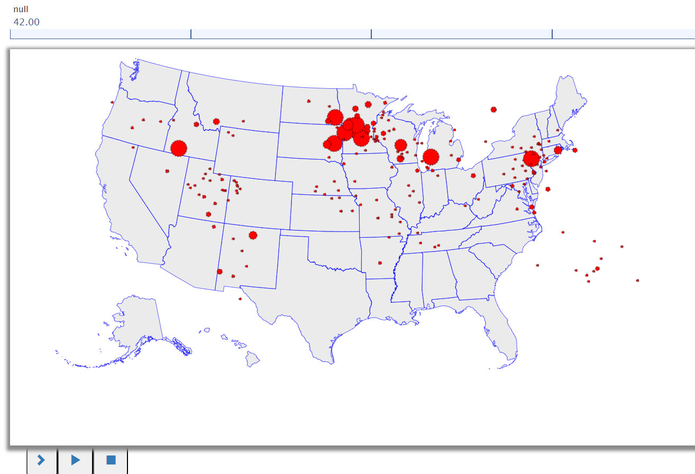

# Covid Dataset Visualization - 42

This program is designed to read COVID-19 confirmed cases data from a CSV file, process the data, and generate a graph using the BRIDGES library for visualization.

</img>

## Goals
The purpose of this assignment is to learn to
1. Read COVID-19 confirmed cases data from a CSV file, handle CSV file parsing, and store the data in a suitable data structure.
2. Create a BRIDGES graph with a world map overlay to plot the COVID-19 case data
	for each country
3. Visualize through a a line chart the total cases for the 80 days

## Description
This program is designed to read COVID-19 confirmed cases data from a CSV file, process the data, and generate a graph using the BRIDGES library for visualization.
### Tasks
1. Read CSV file using BufferedReader and initialize variables
2. Use a list or dictionary of objects  to store CSV data 
3. Create a graph for each recent day, setting vertices' locations, colors, and sizes based on the cases for each day

### Help
#### For C++
[Bridges documentation](http://bridgesuncc.github.io/doc/cxx-api/current/html/classbridges_1_1_bridges.html)

[File I/O](http://www.cplusplus.com/doc/tutorial/files/)

[GraphAdjList documentation](http://bridgesuncc.github.io/doc/cxx-api/current/html/classbridges_1_1datastructure_1_1_graph_adj_list.html)
#### For Java

[Bridges documentation](http://bridgesuncc.github.io/doc/java-api/current/html/classbridges_1_1connect_1_1_bridges.html)

[GraphAdjList documentation](http://bridgesuncc.github.io/doc/java-api/current/html/classbridges_1_1base_1_1_graph_adj_list.html)

#### For Python

[Bridges documentation](http://bridgesuncc.github.io/doc/python-api/current/html/classbridges_1_1bridges_1_1_bridges.html)

[GraphAdjList documentation](http://bridgesuncc.github.io/doc/python-api/current/html/classbridges_1_1graph__adj__list_1_1_graph_adj_list.html)
