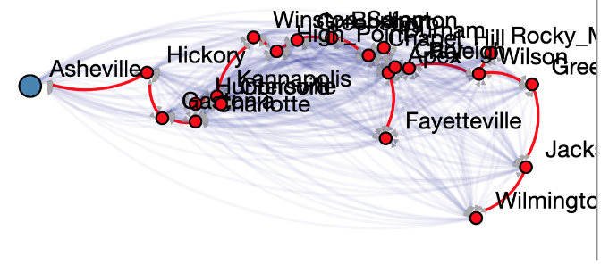

Minimum Spanning Tree on  US Cities (Prim's Algorithm)
=====================================================

Goals
-----

The purpose of this assignment is to learn to

1. Implement Prim's Minimum Spanning Tree Algorithm and demonstrate its
	application using US city data.
2. Use the BRIDGES Graph class to store the input graph
3. Experiment with two variants of the algorithm
3. Visualize the results using BRIDGES

Programming
----------------

### Tasks
1. Build the graph using the US City data - refer to the tutorial on
	[US cities](http://bridgesuncc.github.io/tutorials/Data_USCities.html)
	for accessing the data
2. Implement Prim's MST algorithm, using the US City data a
	* Variant 1: Greedy operation uses the entire unvisited graph
	* Variant 2: Greedy operation visits only the fringe nodes of the tree

3. Visualize using BRIDGES
    * Highlight the starting city
    * Label the nodes with city names 
    * Use the map facilities in BRIDGDES to embed the  MST in a US map, using
	 the setMapOverla()y and setMap() methods of the BRIDGES class.

### References

[GraphAdjList Java](http://bridgesuncc.github.io/doc/java-api/current/html/classbridges_1_1base_1_1_graph_adj_list.html)  
[GraphAdjList C++](http://bridgesuncc.github.io/doc/cxx-api/current/html/classbridges_1_1datastructure_1_1_graph_adj_list.html)   
[GraphAdjList Python](https://bridgesuncc.github.io/doc/python-api/current/html/classbridges_1_1graph__adj__list_1_1_graph_adj_list.html)

