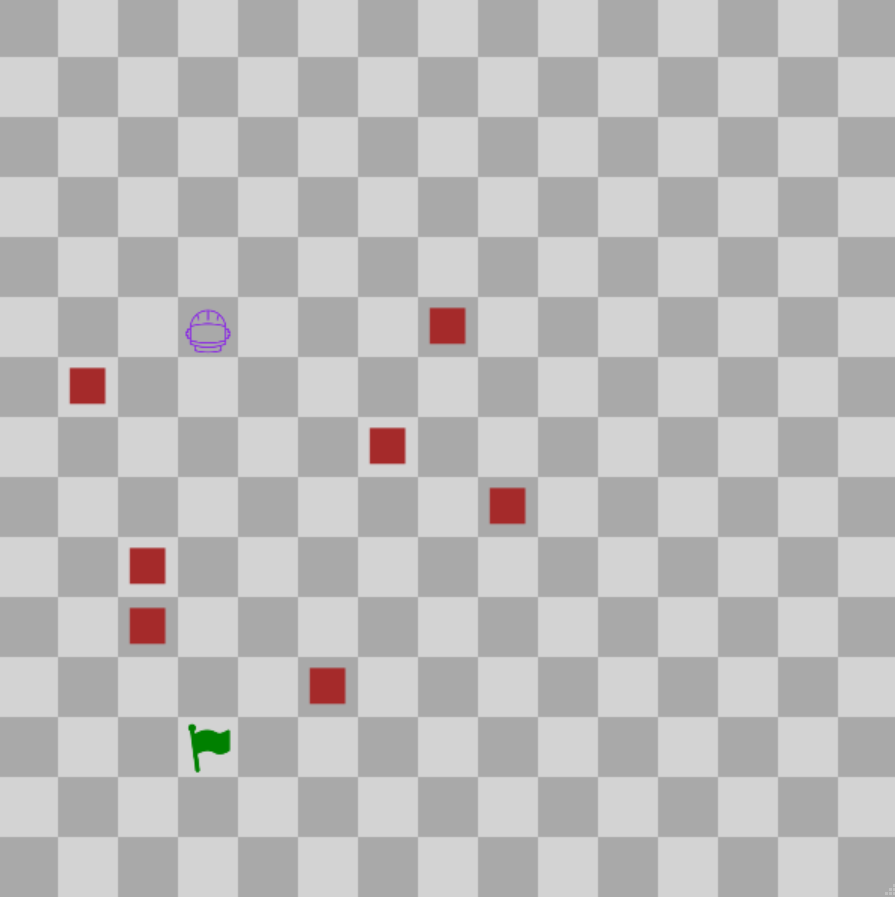

## Explorer Robot - 45
This assignment is adapted from an assignment created by Henry M. Walker. [Source](https://engage-csedu.org/node/2037)

</img>

## Goals

The purpose of this assignment is to learn to
 - Use if/else statements to control program flow
 - Use methods to control objects
 - Manipulate and read 2D arrays

## Descriptions
### Tasks
 - Complete gameLoop() function in the ExplorerRobot file to make the robot reach the goal.
 - Do this for each of the three levels (0, 1, and 2) by changing the int passed to the selectLevel() function in initialize() (Line 21)
 - The gameLoop() function will loop about twice per second, so you won't need to implement any loops of your own
 - 

## Help
### Functions
- The robot has a few methods it can use. You can use these by calling them on the variable called "robot".
- These methods can be found in the Robot file, but for reference they are:
- getxLoc(), which returns the X location of the robot (how far from the left side of the screen it is)
- getyLoc(), which returns the Y location of the robot (how far from the top of the screen it is)
- moveUp(), moveDown(), moveRight(), moveLeft(), and stop(), which make the robot do those respective actions.
- You can get the location of the goal by calling getxLoc() and getyLoc() on the "goal" variable.
- Finally, to get the locations of obstacles (on levels 1 or 2), you can check the 2D array in level.obstacleLocations[y][x].
- A value of true indicates that there is an obstacle there, a value of false indicates that there isn't.

  ### Extra Info
  You have access to where all the obstacles are on the board, where the Goal's location is, and the methods listed above.
  Call the robot's methods in order for it to reach the goal. If the robots location contains an obstacle after moving, then the robot loses.

### For Java
[NonBlockingGame documentation](http://bridgesuncc.github.io/doc/java-api/current/html/classbridges_1_1games_1_1_non_blocking_game.html)
### For C++
[NonBlockingGame documentation](http://bridgesuncc.github.io/doc/cxx-api/current/html/classbridges_1_1game_1_1_non_blocking_game.html)
### For Python
[NonBlockingGame documentation](http://bridgesuncc.github.io/doc/python-api/current/html/classbridges_1_1non__blocking__game_1_1_non_blocking_game.html)
