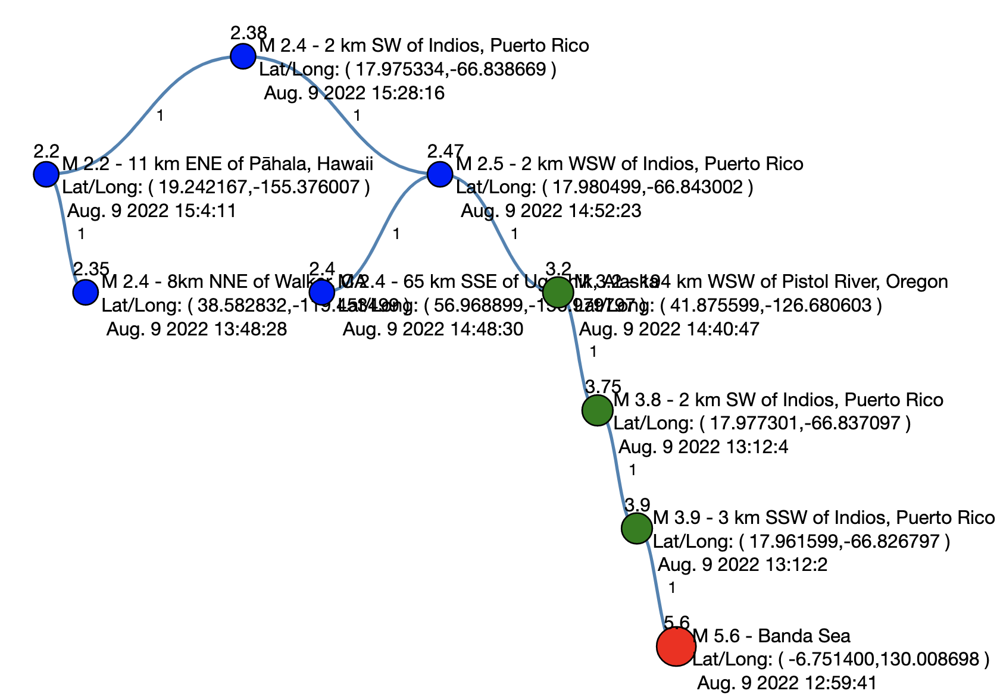

Assignment 37 - BST Construction Using Earthquake Data from USGS
================================================================

</img>

Goals
------
The purpose of this assignment is to learn to
1. Access remote data through BRIDGES.
2. Manipulate a binary search tree using th earthquake magnitude (or some other attribute) as a search key

You will generate a visualization that looks like the figure above.

Programming part
---------------------
### Task
Build a binary search tree where each node represents an earthquake record
### Steps
1. Open your base code.
2. Plug in your credentials.
3. Compile and run the code and observe the basic binary search tree
### Build the binary search tree with earthquake data
1. Your `BSTElement` will use `EarthquakeUSGS` as the generic parameter, using
	float as the key type (`BSTElement<float, EarthquakeUSGS)`
2. Write an insert() method, creating and  inserting earthquake records 
	into the the binary search tree, using the magnitude of the quake as 
	a search key.
3. Color the root node in  a unique color, the remaining nodes in a different
	color.
4. Traverse the tree to find the largest, smallest quakes, or highlight 
	quakes by magnitude, by location, by date, etc.
### Reference
#### Java
[BSTElement documentation](http://bridgesuncc.github.io/doc/java-api/current/html/classbridges_1_1base_1_1_b_s_t_element.html)

[Element documentation](http://bridgesuncc.github.io/doc/java-api/current/html/classbridges_1_1base_1_1_element.html)

[EarthquakeUSGS documentation](http://bridgesuncc.github.io/doc/java-api/current/html/classbridges_1_1data__src__dependent_1_1_earthquake_u_s_g_s.html)

#### C++ Reference
[BSTElement documentation](http://bridgesuncc.github.io/doc/cxx-api/current/html/classbridges_1_1datastructure_1_1_b_s_t_element.html)

[Element documentation](http://bridgesuncc.github.io/doc/cxx-api/current/html/classbridges_1_1datastructure_1_1_element.html)

[EarthquakeUSGS documentation](http://bridgesuncc.github.io/doc/cxx-api/current/html/classbridges_1_1dataset_1_1_earthquake_u_s_g_s.html)

#### Python Reference

[BSTElement documentation](http://bridgesuncc.github.io/doc/python-api/current/html/classbridges_1_1bst__element_1_1_b_s_t_element.html)

[Element Documentation](http://bridgesuncc.github.io/doc/python-api/current/html/classbridges_1_1element_1_1_element.html)

[EarthquakeUSGS documentation](http://bridgesuncc.github.io/doc/python-api/current/html/classbridges_1_1data__src__dependent_1_1earthquake__usgs_1_1_earthquake_u_s_g_s.html)
