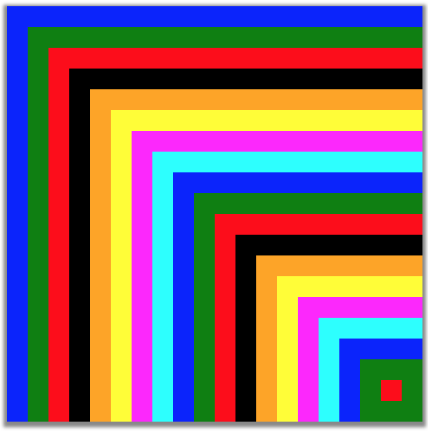

Layers - Generating layers of pixels from a 2D Grid
===================================================

## Goals

1. Working with 2D grids to generating pixels in a certain order
2. Indexing into 2D arrays and ensuring bounds are not violated
3. CS concepts: 2D array addressing 

## Source
This assignment is  part of a larger assignment [insert link here] on 
determining the closest point to a given point within a 2D map, eg., finding
the nearest restaurant from a given location.

## Description
As part of the more interesting problem of finding the nearest location of
a given entity, this assignment uses a 2D grid as a search structure to 
accelerate the search. A uniform 2D grid is overlaid on the underlying
map and entities are stored in grid cells. While the closest problem is 
solved in the more complete assignment, this assignment helps early CS 
students to generate an efficient  search path, i.e., the search begins
from the start location and identifies cells around it, layer by layer. 
This is an excellent exercise for practicing 2D indexing and making sure
that the algorithm always works within the bounds of the array. The
output is shown as a visualization using the ColorGrid type in BRIDGES. Below
we show two examples of generating the layers, with the starting cell in
red, which can be any pixel in the grid.

 
</img>
</img>

### Algorithm To Determine the layers:
You can start from the starting cell (which is input to the algorithm) and
start generating layers from inside out, i.e., the first layer will be the 8
cells surrouding the start cell (unless its on the boundary, in which case there wwill be fewer), then look at the second layer's neighbors and so on until the the boundary of the grid is reached. The above examples show the layers generated
starting from a central cell and one on the boundary. The key is to ensure 
you never run out of the grid. The visualization, that uses a Color Grid provides the 2D array structure and produces a nice visualization. Here we color each layer in a different color.

 

## Tasks

1. In the main program, you do the initializations for Bridges and set up the color grid of some size (limit is HD resolution). 

2. All of the work will be done by the layer generating algorithm, which will 
first mark the start cell and for each layer (layer number can be 
as large as the grid width or height) you identify the neighbors. This is
done in 4 parts: identify the top row neighbors, then the bottom row neighbirs
and then the left and right columns.

3. You can optimize the algorithm and ensure each cell is visited exactly  once.
For instance, after you visit the top and bottom row neighbors, the left and
right columns will have 1 fewer cell to visit. When the algorithm gets close
to the boundary, you need to ensure if the neighbors do exist or not and 
appropriately adjust for that. Any of the 2 rows or columns can be missing as
the algorithm gets close to the boundary.

4. As you identify each cell in a layer, mark the colorgrid entry with a color
for that layer. Thus, once your algorithm completes normally, you can check
the visualization to see if the layers were computed correctly! An easy way to 
debug!

## Variants

One variant to the assignment would be to start from the outer layers and work
inwards. Or an assignment can simply start with the normal 2 loops to visit 
all elements of the grid and then attempt the layers algorithms.

## Additional Help:

[BRIDGES Team:](http://bridgesuncc.github.io/) Contact the BRIDGES team for any 
issues with the BRIDGES API. This is an active project.

#### Documentation for Java

[ColorGrid documentation](http://bridgesuncc.github.io/doc/java-api/current/html/classbridges_1_1base_1_1_color_grid.html)

[Color documentation](http://bridgesuncc.github.io/doc/java-api/current/html/classbridges_1_1base_1_1_color.html)

[Bridges class documentation](http://bridgesuncc.github.io/doc/java-api/current/html/classbridges_1_1connect_1_1_bridges.html)

#### Documentation for C++
[ColorGrid documentation](http://bridgesuncc.github.io/doc/cxx-api/current/html/classbridges_1_1datastructure_1_1_color_grid.html)

[Color documentation](http://bridgesuncc.github.io/doc/cxx-api/current/html/classbridges_1_1datastructure_1_1_color.html)

[Bridges Class documentation](http://bridgesuncc.github.io/doc/cxx-api/current/html/classbridges_1_1_bridges.html)

#### for Python

[ColorGrid documentation](http://bridgesuncc.github.io/doc/python-api/current/html/classbridges_1_1color__grid_1_1_color_grid.html)

[Color documentation](http://bridgesuncc.github.io/doc/python-api/current/html/classbridges_1_1color_1_1_color.html)

[Bridges documentation](http://bridgesuncc.github.io/doc/python-api/current/html/classbridges_1_1bridges_1_1_bridges.html)

