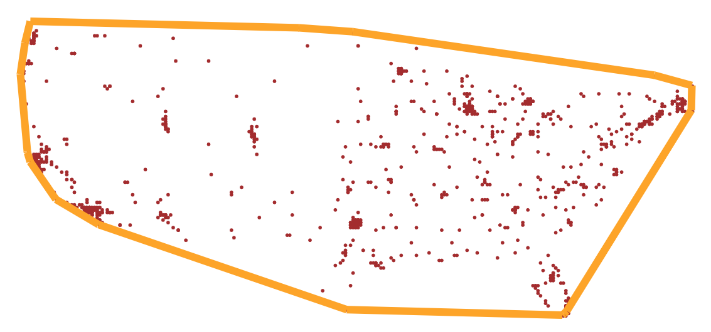
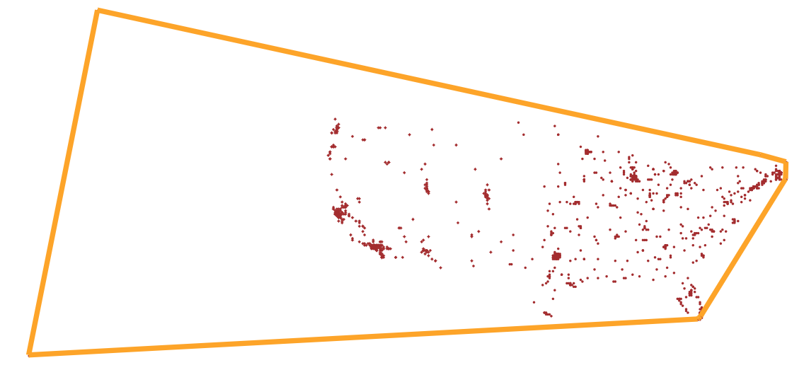

Convex Hull
================

Goals
-----

The purpose of this assignment is to learn to
 1. Use US city dataset
 2. Determine the  Convex Hull  of a set of locations representing
	US Cities, using a brute-force approach
 3. Determine the  Convex Hull  of a set of locations representing
	US Cities, using a divide and conquer approach
 4. Use BRIDGES to visualize solution

What is the Convex Hull
-----------------------

The convex hull The convex hull of a set of points can be defined as the 
tightest fitting polygon that encloses them. The goal is to identify the 
points and edges that make up this polygon. Here we will use the US city 
locations as 2D points to determine the convex hull. See the figures below 
that you will end up in the visualization:

Algorithms: Brute Force
-----------------------
This is the simpler but less efficient algorithm (O(N^2) and not appropriate 
for very large datasets. Its implementation is much simpler compared to the
divide and conquer version (see below).  The algorithm consists of iterating 
through each point and testing all line segments emanating from it as 
potential candidates. An edge is part of the convex hull, if all of the 
remaining points are to its 'left' (one sided). At the end of the process, 
you have the set of edges that make up the convex hull and are drawn to 
illustrate it.

### Testing for 'Leftness':

We can use the line equation of the candidate edge and evaluate the point using the equation and look at its sign, which indicates the side of the line that point lies.  If all points evaluate to the same side, we accept this edge as part of the convex hull.

The equation of  a line (in 2D) is of the form

Ax + By + C = 0

where the point (x, y)  is on the line.  Any point that is not on the line 
is  one side or the other and evaluating the above equation with such 
points will result in a value (actually a distance to the line) that is 
positive or negative. The coefficients, A, B and C are constants 
representing the direction cosines of the line (or  the normal vector).

If pt1 and pt2 are  two points that make up an edge, then then we can 
calculate the  direction cosines as

A = pt2.y  - pt1.y
B = pt1.x  - pt2.x
C = pt1.x*pt2.y - pt1.y*pt2.x

A, B come from the slope (dy/dx), and C  (intercept) is obtained by plugging  
one of the line end points into the equation (the derivation is easier if 
you start with y  = mx + c, where m is the slope and c is the intercept. 
The above form is more convenient for implementation.

Thus, the algorithm iterates with each point and forming edges with the 
rest of the points and checking the sign of  the distance (result of 
evaluating the line equation) with the second end point of the potential edge). If all distances are of the same sign, then you accept that edge as part 
of the convex hull.

Algorithms: Divide and Conquer
------------------------------
A more efficient algorthm to compute the convex hull is to use a divide
and conquer strategy, which has been shown to achieve linear time (O(N)) in
practice. It involves recursively subdividing the pointset into two subsets
and exploiting geometric relationships to ignore large sets of points
from consideration in the search for the edges that make up the convex hull

### Details of Algorithm
ToDo (Reference, Levitin, The Design and Analysis of Algorithms)

### Assignment Tasks
- Read the input city data
- Plot the cities using the BRIDGES SymbolCollection class features
	and visualize the result
- Implement Brute force convex hull algorithm, draw the resulting convex
	polygon that makes up the convex hull; visualize the results

Expected Output:
----------------
See the figures above for what the output will look like 
(with and without cities in Alaska and Hawaii):

### Help
#### For C++
[SymbolCollection documentation](https://bridgesuncc.github.io/doc/cxx-api/current/html/classbridges_1_1datastructure_1_1_symbol_collection.html)

[Circle](https://bridgesuncc.github.io/doc/cxx-api/current/html/classbridges_1_1datastructure_1_1_circle.html)

[Polyline](https://bridgesuncc.github.io/doc/cxx-api/current/html/classbridges_1_1datastructure_1_1_polyline.html)

[Text](http://bridgesuncc.github.io/doc/cxx-api/current/html/classbridges_1_1datastructure_1_1_text.html)

#### For Java
[SymbolCollection documentation](https://bridgesuncc.github.io/doc/java-api/current/html/classbridges_1_1base_1_1_symbol_collection.html)

[Circle](http://bridgesuncc.github.io/doc/java-api/current/html/classbridges_1_1base_1_1_circle.html)

[Polyline](http://bridgesuncc.github.io/doc/java-api/current/html/classbridges_1_1base_1_1_polyline.html)

[Text](http://bridgesuncc.github.io/doc/java-api/current/html/classbridges_1_1base_1_1_text.html)

#### For Python
[SymbolCollection documentation](https://bridgesuncc.github.io/doc/python-api/current/html/classbridges_1_1symbol__collection_1_1_symbol_collection.html)

[Circle](http://bridgesuncc.github.io/doc/python-api/current/html/classbridges_1_1circle_1_1_circle.html)

[Polyline](http://bridgesuncc.github.io/doc/python-api/current/html/classbridges_1_1polyline_1_1_polyline.html)

[Text](http://bridgesuncc.github.io/doc/python-api/current/html/classbridges_1_1text_1_1_text.html)
[SymbolCollection documentation](https://bridgesuncc.github.io/doc/python-api/current/html/classbridges_1_1symbol__collection_1_1_symbol_collection.html)
