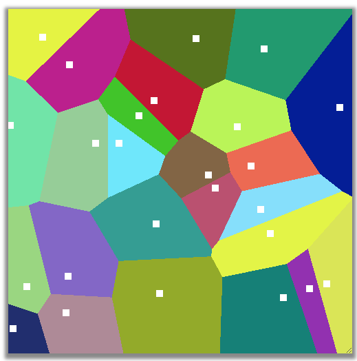

Voronoi Diagrams - Determining  the Voronoi Regions of a Set of Points in a 2D Plane
=====================================================================================

## Goals/Learning Objectives

1. Use of Loops and Conditionals
2. Compute proximal regions  of a set of sites and display them using a brute force approach
3. Application to Delaunay triangulations, useful in graphics, robotics

## Source
This assignment is adapted from a **[Nifty](http://nifty.stanford.edu/)  assignment 
from 2016 proposed by Baker Franke. See **[Source](http://nifty.stanford.edu/2016/franke-mountain-paths/)

## Reference
Wikipedia, https://en.wikipedia.org/wiki/Voronoi_diagram
[Wikipedia:](https://en.wikipedia.org/wiki/Voronoi_diagram) 

## Description
In this project, you are building a Voronoi Diagram of a set of sites in the 2D planeusing a brute-force approach. The Voronoi diagram is a partition of a plane into
regions such that all points in a region are closer to Voronoi site (or object) 
than any other site. You will demonstrate this on a 2D grid of points  and use
Euclidean distances to compute proximity. Example outputs are shown below. The white squares
are the Voronoi sites.

### Algorithm To Determine the Path:

The brute-force algorithm is straight forward and consists of the following steps

1. *generate sites* Given a 2D grid  representing a planar region, generat a set of 2D points
within the region. You can generate these points randomly or through user input.  Keep these in
a list as each of these points willi be part of a Voronoi region

2. *Compute Distance between points* You will need to be able to compute a distance between a point
	on the grid and a Voronoi site. You can use any distance metric, for instance Euclidean distance.
	You only need the distance squared, as we are only comparing distances

3  *Determine the Voronoi regions* You will use a brute force approach. Loop through each point in
the grid and compute each grid point's distance to each Voronoi site. Record the smallest distance
in a data structure and the associated Voronoi site's index. At the end of this process, you will 
have a distance map with indices of sites, which are proxies for the Voronoi region

4. *Visualize the Voronoi Diagram* Use the BRIDGES ColorGrid object to view the Voronoi regions and
	the sites. Generate  color for each Voronoi region (can generate it randomly with an (R,G,B) 
	for each each region.  Now iterate through the distance map and for each grid point, set the 
	color corresponding to the site index in the color grid. 

	You will also mark the sites in each region. Loop through the sites, and use a constant color
	to mark the site in each region (the white squares in the figure above are the Voronoi sites)

	Visualize your Voronoi diagram using BRIDGES. 

5.  *Testing/Error Checking* Make the sites a bit larger by coloring a small square of pixels, as
	shown above. But make sure you dont run outside the grid in doing so! Vary the number of sites
	and grid size to get nice smooth reagion boundaries (the above image was done with a grid size
	fo 500x500 and 25 sites
 

## Extensions

If you want to identify the points that make up the boundaries of the region, how would you do that?
Think in terms of image processing and use the distance map you created in your program.

## Additional Help:

[BRIDGES Team:](http://bridgesuncc.github.io/) Contact the BRIDGES team for any 
issues with the BRIDGES API. This is an active project.

#### for Java

[DataSource](http://bridgesuncc.github.io/doc/java-api/current/html/classbridges_1_1connect_1_1_data_source.html)

[ColorGrid documentation](http://bridgesuncc.github.io/doc/java-api/current/html/classbridges_1_1base_1_1_color_grid.html)

[Color documentation](http://bridgesuncc.github.io/doc/java-api/current/html/classbridges_1_1base_1_1_color.html)

[Bridges class documentation](http://bridgesuncc.github.io/doc/java-api/current/html/classbridges_1_1connect_1_1_bridges.html)

#### for C++
[ElevationData Documentation](http://bridgesuncc.github.io/doc/cxx-api/current/html/classbridges_1_1dataset_1_1_elevation_data.html)

[ColorGrid documentation](http://bridgesuncc.github.io/doc/cxx-api/current/html/classbridges_1_1datastructure_1_1_color_grid.html)

[Color documentation](http://bridgesuncc.github.io/doc/cxx-api/current/html/classbridges_1_1datastructure_1_1_color.html)

[Bridges Class documentation](http://bridgesuncc.github.io/doc/cxx-api/current/html/classbridges_1_1_bridges.html)

#### for Python

[ColorGrid documentation](http://bridgesuncc.github.io/doc/python-api/current/html/classbridges_1_1color__grid_1_1_color_grid.html)

[Color documentation](http://bridgesuncc.github.io/doc/python-api/current/html/classbridges_1_1color_1_1_color.html)

[Bridges documentation](http://bridgesuncc.github.io/doc/python-api/current/html/classbridges_1_1bridges_1_1_bridges.html)

