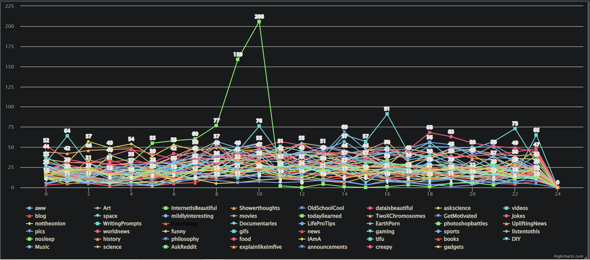

# Graph different subreddits usage per hour for a day!

## Goals

- Populate arrays with items
- Get data from other classes
- Use Unix timestamps

## Description

Students will write code to itterate over a collection of Reddit posts. Their code will count the number of posts in each hour

### Example Output

This is using all the data provided, notice how cluttered it is. You can choose to use specific subreddits by limiting the array, rather then the full dataset.

## Programming

### Tasks

1. Populate xValues array with hours 0-24 in a day (24 Time format)
2. Create a for loop to iterate over reddit array.
3. Get the hours from each post given
4. Convert unix time into hours using language specific
5. Get the hours from each post given
6. Increase the value of the (hour) slot of the array by one for each post
	
## Help
[Reddit dataset tutorial](http://bridgesuncc.github.io/tutorials/Data_Reddit.html)
### For C++
  [C++ Reddit Class](http://bridgesuncc.github.io/doc/cxx-api/current/html/classbridges_1_1dataset_1_1_reddit.html)
### For Java
[Java Reddit Class Documentation](http://bridgesuncc.github.io/doc/java-api/current/html/classbridges_1_1data__src__dependent_1_1_reddit.html)

[Calender class documentation](https://docs.oracle.com/javase/7/docs/api/java/util/Calendar.html)
### For Python
[Python Reddit Class Documentation](http://bridgesuncc.github.io/doc/python-api/current/html/classbridges_1_1data__src__dependent_1_1reddit_1_1_reddit.html)

[Python Datetime Documentation](https://docs.python.org/3/library/datetime.html)

