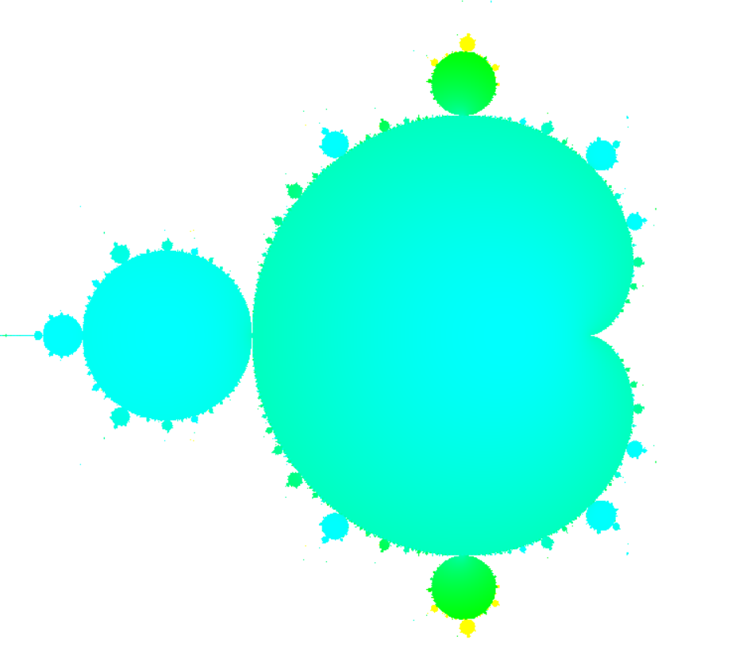

# Assignment 74 - Fractals

## Example Output

</img>

## Learning Outcomes

1. 2D Arrays
2. Loops
3. Visualization

## Goals
1. Learn how to use the BRIDGES ColorGrid to display the Mandelbrot set
2. Implement complex number operations within loops to generate fractals
3. Set pixel colors dynamically based on convergence rates in the Mandelbrot set

## Description
Mandelbrot Set
The Mandelbrot set is a well-known fractal defined by iterating the equation z = z^2 + c in the complex plane, where points that do not diverge after many iterations form the set.
### Assignment
Use the BRIDGES ColorGrid to display the Mandelbrot set
Perform complex arithmetic to calculate pixel values based on convergence
Utilize loops to iterate over each pixel and assign appropriate colors
### Examples
Generate and display the Mandelbrot set with custom resolutions and color schemes
Modify the iteration limits or color mappings for variations
Experiment with different ranges in the complex plane for zoom effects

## Extensions

## Help

#### for C++
[ColorGrid documentation](http://bridgesuncc.github.io/doc/cxx-api/current/html/classbridges_1_1datastructure_1_1_color_grid.html)
[Color documentation](http://bridgesuncc.github.io/doc/cxx-api/current/html/classbridges_1_1datastructure_1_1_color.html)
[Bridges class documentation](http://bridgesuncc.github.io/doc/cxx-api/current/html/classbridges_1_1_bridges.html)

#### for Java
[ColorGrid documentation](http://bridgesuncc.github.io/doc/java-api/current/html/classbridges_1_1base_1_1_color_grid.html)
[Color documentation](http://bridgesuncc.github.io/doc/java-api/current/html/classbridges_1_1base_1_1_color.html)
[Bridges class documentation](http://bridgesuncc.github.io/doc/java-api/current/html/classbridges_1_1connect_1_1_bridges.html)

#### for Python
[ColorGrid documentation](http://bridgesuncc.github.io/doc/python-api/current/html/classbridges_1_1color__grid_1_1_color_grid.html)
[Color documentation](http://bridgesuncc.github.io/doc/python-api/current/html/classbridges_1_1color_1_1_color.html)
[Bridges class documentation](http://bridgesuncc.github.io/doc/python-api/current/html/classbridges_1_1bridges_1_1_bridges.html)

