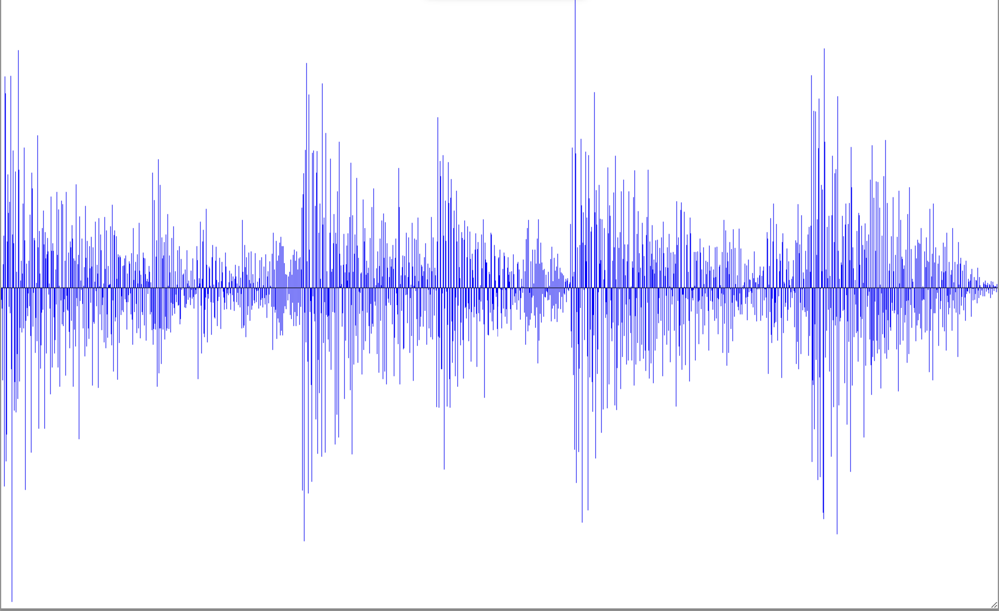
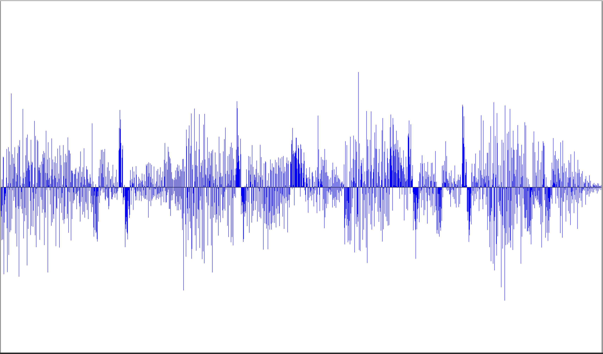

# Thresholding - 78

## Example Image

</img>

</img>

## Goals

Students will be able to visualize an audio signal from a file and create 
conditionals to threshold the signals within a range and listen to the 
distorted signal

## Description

Students will load an audiofile and visualize it. They will loop through the audio wave and get the portions of it that fall above and/or below a certain amplitude. They will then manipulate the audio that falls within that range.

### Tasks
1. Complete oriSample() Method by initializing an audio clip and using that to create a 1d array
2. Input APIKEY and Username, then run the assignment to see what the original audio looks like.
3. Create a value for thresholding
4. Loop over the array inputted and change any value above the thresholding value to the thresholding value
5. Visualize the assignment

## Extensions
- Scaffold the 1D array to allow for earlier CS1 students to complete

## Help

Audioclip transforms the .wav files to a object we can manipulate.
May need to zoom out to see the full grid.
### C++

[AudioClip Documentation](https://bridgesuncc.github.io/doc/java-api/current/html/classbridges_1_1base_1_1_audio_clip.html)

[ColorGrid Documentation](https://bridgesuncc.github.io/doc/cxx-api/current/html/classbridges_1_1datastructure_1_1_color.html)

### Java

[AudioClip Documentation](https://bridgesuncc.github.io/doc/java-api/current/html/classbridges_1_1base_1_1_audio_clip.html)

[ColorGrid Documentation](https://bridgesuncc.github.io/doc/java-api/current/html/classbridges_1_1base_1_1_color_grid.html)

### Python

[AudioClip Documentation](https://bridgesuncc.github.io/doc/python-api/current/html/classbridges_1_1audio__clip_1_1_audio_clip.html)

[ColorGrid Documentation](https://bridgesuncc.github.io/doc/python-api/current/html/classbridges_1_1color__grid_1_1_color_grid.html)
