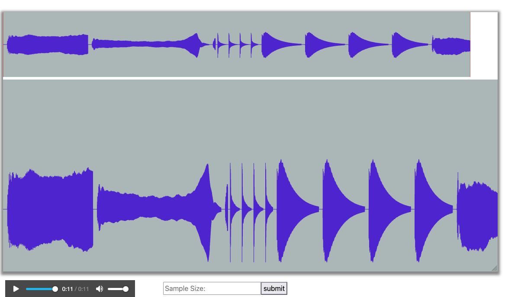

# Create Musical Instruments and Play a Song

## Goals

Students will create full classes of intruments that implement a given 
interface. Students will use these instruments to create a AudioClip 
that can be played as sound using BRIDGES.

## Example Output of a Song (set of notes)
</img> 
<b> An example set of notes of Cello and Marimba </b>

## Description

Students will create and implement an Instrument interface. Each instrument 
will have its own class and implement this interface. Each instrument will 
store a set of notes for each instrument (with examples provided as wav files).
These notes will be used together  (in sequence) to compose and demonstrate 
a song.

## Tasks
1. Specify the Instrument interface
2. Implement a class for each instrument using the interface
3. Use the instrument class to load the notes for that instrument
4. Implement a method to create a song audio clip with a sequence of 
   instrument notes and create the song's audio.
5. Make the needed BRIDGES calls and pass the song audio clip to it
5. Visualize the audio clip.

## Help

### For C++

[AudioClip Documentation](https://bridgesuncc.github.io/doc/java-api/current/html/classbridges_1_1base_1_1_audio_clip.html)

### For Java

[AudioClip Documentation](https://bridgesuncc.github.io/doc/java-api/current/html/classbridges_1_1base_1_1_audio_clip.html)

### For Python

[AudioClip Documentation](https://bridgesuncc.github.io/doc/python-api/current/html/classbridges_1_1audio__clip_1_1_audio_clip.html)
