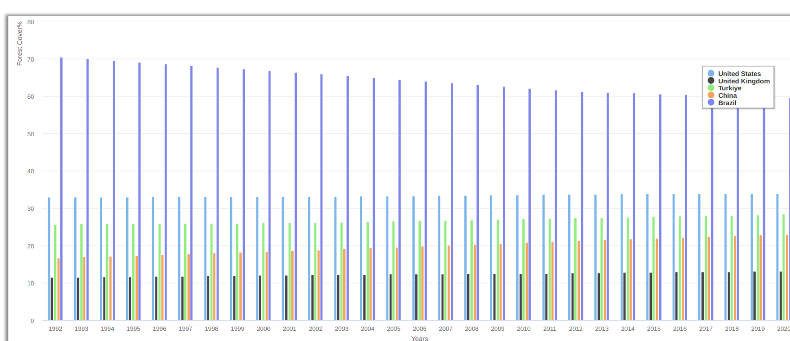

# Assignment 84 - SETUP

## Learning Outcomes

Visualize Data in the form of a Bar Chart

## Goals

The purpose of this assignment is to
1. Teach students how to use the Bridges BarChart Data Structure to display data
2. Learn How to parse Csv data
3. Learn How to use HashMap's to store data.

You will generate a visualization that looks like the figure above.

### Task
Visualize Energy Consumption per Capita for 5 Countries of your choice that Exist in the given CSV file.

### Steps
1. Implement the given function to Parse the Energy Data for 5 countries
2. Store them in their respective key,value pairs for a Hashmap
3. Pass Data to the BarChart Object and Lable the Title,X/Y Axis's'
4. Hint: Use Vectors for C++. Array's for Java & and Python'

## Help

#### for Java
[BarChart Class](https://bridgesuncc.github.io/doc/java-api/3.4.3-8-g731f2b7/html/)

#### for C++

[BarChart Class](https://bridgesuncc.github.io/doc/cxx-api/3.4.4-32-gf4d4148/html/)

#### For Python

[BarChar Class](https://bridgesuncc.github.io/doc/python-api/3.4.4-26-g1c7f7ad/html/)
