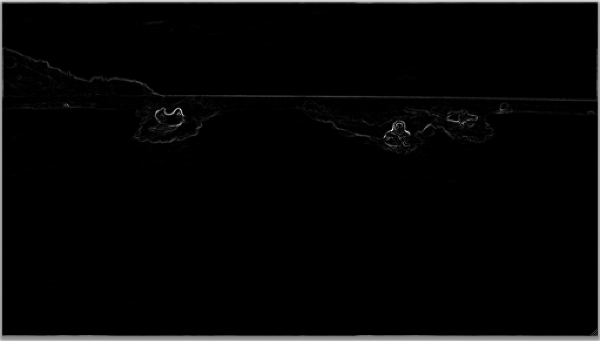
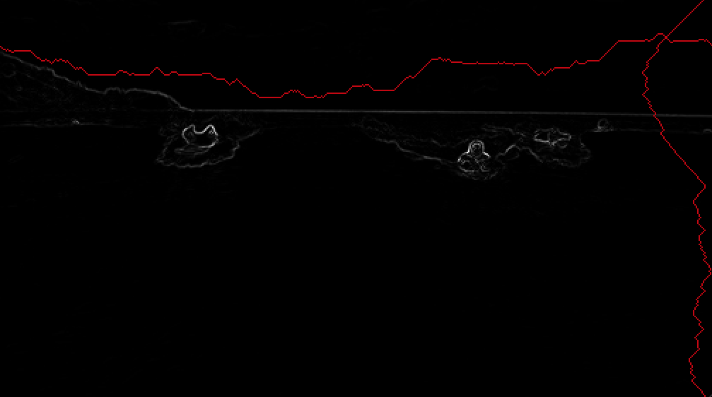

# Assignment 87 - Seam Carving Images

## Learning Outcomes

Resize images with a shortest path algorithm

## Goals

1. File I/O
2. 2D arrays (Image processing/filtering)
3. Alg Design: Dynamic Progamming
4. Alg Design: Greedy approach (graph shortest paths)

</img> 
<b> Original Image</b> 
</img> 
<b> Energy Image </b> 
</img> 
<b> Horizontal and Vertical Seams</b>

You will generate a visualization that looks like the figures above.

### Task
Visualize a resized version  of a given image while retaining key image objects
and features

### Steps
1. Read the given image 
2. Compute the energy at each pixel using central differences in X and Y and summing the squares of the gradients in red, green, blue components
3. Identify vertical and horizontal seams by determining a sequence of pixels that minimize the energy sum along the seam.
4. Can use a dynamic programming  or a shortest path approach to the optimization.
	1. For dynamic programming, start with the bottom row  with the energy values. Then update the rows above forming the optimal energy sums, using the 3 nearest neighbors (left, middle, right). For horizontal seams, start from the right most column.
	2. For shortest path approach, build a graph with each pixel forming edges to its 3 nearest neighbors (down for vertical, right for horizontal seams). Create a node to connect to all pixels in the top row and another to connect to the pixels in teh bottom row. Run Dijkstra's shortest path algorithm.
5. Identify the pixels in the seam by following the smallest pixel in each row (for vertical seam) or column (for horizontal seam), among the 3 nearest neighbors.
6. Remove the identified seam pixels 
	
		

## Help

#### for Java

[ColorGrid Class](https://bridgesuncc.github.io/doc/java-api/current/html/classbridges_1_1base_1_1_color_grid.html)

#### for C++

[ColorGrid Class](https://bridgesuncc.github.io/doc/cxx-api/current/html/classbridges_1_1datastructure_1_1_color_grid.html)

#### For Python

[ColorGrid Class](https://bridgesuncc.github.io/doc/python-api/current/html/classbridges_1_1color__grid_1_1_color_grid.html)
