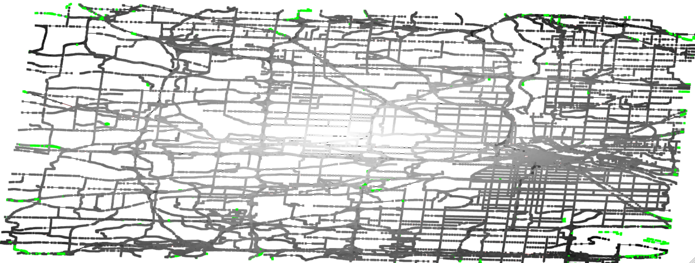

Shortest Path in Real Cities
============================

Goals
-----

Implement Dijkstra's algorithm and run it on a real world scenario: your city's map.

Tasks
-----

1. Get map information for your city using Bridges API: DataSource.getOSMData()

2. Build a graph for your city using the edge data you just obtained
(or use Bridges builtin graph build OSMData.getGraph). Render that map
using Bridges.

3. Find the closest vertex to the center of your map to be used as the
source vertex. You can get coordinates using OSMVertex.getLatitude()
and OSMVertex.getLongitude(). You can color that vertex in the map to
see if the calculation is correct.

4. Compute shortest path from the source vertex by implementing a
shortest path algorithm such as Dijkstra's algorithm.

5. Color the map based on their distance from the source vertex.

Sample Output
-------------

Variants
--------

One can see the complexity of the algorithm by running larger and
larger maps. You can plot the runtime of the algorithm as a function
of the size of the graph (nb vertices or edges) by using LineChart.

Which priority queue did you use to compute Dijkstra's algorithm?
Different queues can be used that lead to simpler or more complex
implementation. The two most common implementation are to use a Sorted
Array as a priority queue, to use a min-Heap, or to use a Fibonnacci
Heap. Implement them and compute runtime for graphs of different
scales. You can show the runtime using the LineChart feature of
Bridges.

Identifying the vertex the closest to a coordinate is a good
application for using quad-trees.

### Help
#### For C++
[Bridges documentation](http://bridgesuncc.github.io/doc/cxx-api/current/html/classbridges_1_1_bridges.html)

[GraphAdjList documentation](http://bridgesuncc.github.io/doc/cxx-api/current/html/classbridges_1_1datastructure_1_1_graph_adj_list.html)

[OSMData documentation](http://bridgesuncc.github.io/doc/cxx-api/current/html/classbridges_1_1dataset_1_1_o_s_m_data.html)

[ShortestPathBenchmark documentation](http://bridgesuncc.github.io/doc/cxx-api/current/html/classbridges_1_1benchmark_1_1_shortest_path_benchmark.html)

[DataSource documentation](http://bridgesuncc.github.io/doc/cxx-api/current/html/classbridges_1_1_data_source.html)

#### For Java

[Bridges documentation](http://bridgesuncc.github.io/doc/java-api/current/html/classbridges_1_1connect_1_1_bridges.html)

[GraphAdjList documentation](http://bridgesuncc.github.io/doc/java-api/current/html/classbridges_1_1base_1_1_graph_adj_list.html)

[OSMData documentation](http://bridgesuncc.github.io/doc/java-api/current/html/classbridges_1_1data__src__dependent_1_1_osm_data.html)

[ShortestPathBenchmark documentation](http://bridgesuncc.github.io/doc/java-api/current/html/classbridges_1_1benchmark_1_1_shortest_path_benchmark.html)

[DataSource documentation](http://bridgesuncc.github.io/doc/java-api/current/html/classbridges_1_1connect_1_1_data_source.html)

#### For Python

[Bridges documentation](http://bridgesuncc.github.io/doc/python-api/current/html/classbridges_1_1bridges_1_1_bridges.html)

[GraphAdjList documentation](http://bridgesuncc.github.io/doc/python-api/current/html/classbridges_1_1graph__adj__list_1_1_graph_adj_list.html)

[OSMData documentation](http://bridgesuncc.github.io/doc/python-api/current/html/classbridges_1_1data__src__dependent_1_1osm_1_1_osm_data.html)

[ShortestPathBenchmark documentation](http://bridgesuncc.github.io/doc/python-api/current/html/namespacebridges_1_1shortest__path__benchmark.html)

