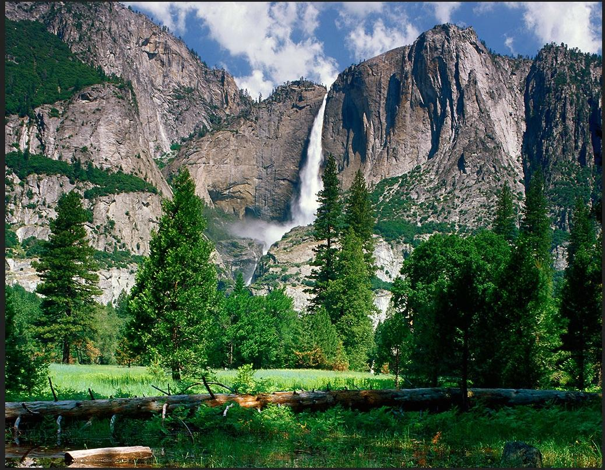
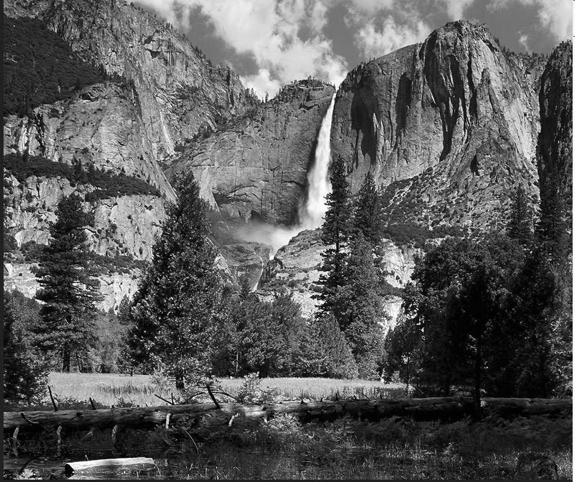
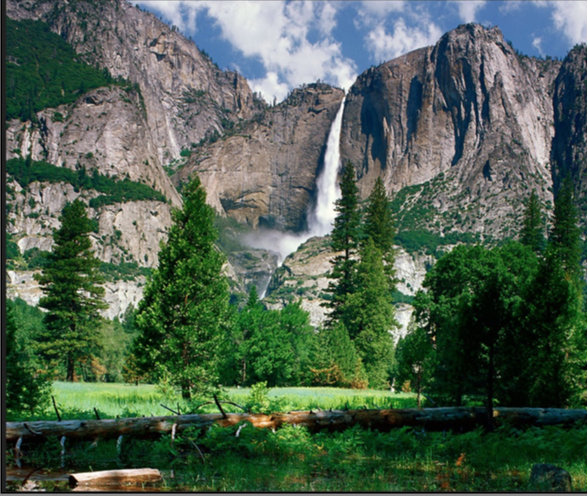

Processing 2D Images
====================

## Goals

1. Working with 2D images.
2. Implementing simple operations on images, such as color manipulation, 
	filtering.
3. CS concepts: 2D array addressing, processing

## Source
This assignment was adapted from a similar assignment(reference unknown); the 
main difference is it eases the ability to work with the BRIDGES API which
helps with displaying the image  using a BRIDGES data structure (ColorGrid).

## Description
Students are provided with sample images in a simple text format (eg., PPM) 
that they read and display using the ColorGrid datatype (an abstraction for 
images). Students are asked to perform a number of simple processing 
operations on the provided input images, such as the one given below. 

**Example Images**

 

Students are provided with a skeleton of an Image class that they will use
to implement the required image processing operations listed below.

 
## Tasks

1. **Read Input Image.[Done for you]** 
2. **Display Image.** You will use BRIDGES to display the image by storing it in
	a ColorGrid object.
3. **Image Processing.**

	 * **toGrayScale.** This method will convert the original RGB PPM image into a 
		*grayscale image.*  You can use the following conversion formula: 

			grayVal  = 0.299R + 0.587G + 0.114B

		where R,G, B are the red, green and blue color components. To display 
		the grayscale image as a PPM image, use the gray value for all 3 
		components,  for example, (128, 128, 128) is gray value midway through 
		the range. Store the processed image in another colorgrid and 
		display it using BRIDGES
     * **Blur**  This method will blur (low pass filter) the image. We will use
		a simple averaging (box) filter within a small neighborhood. Use a 
		5x5 neighborhood (else the filtering wont be noticeable). The idea
		is to sum up all the values in the pixe's 5x5 neighborhood and divide
		it by the number of pixels in the neighborhood. ** do this separately
		for the red, green and blue **. Again keep the processed image
		in a separate ColorGrid and display that using BRIDGES.

## Expected  Output:

 

## Additional Help:

#### for Java

[ColorGrid documentation](http://bridgesuncc.github.io/doc/java-api/current/html/classbridges_1_1base_1_1_color_grid.html)

[Color documentation](http://bridgesuncc.github.io/doc/java-api/current/html/classbridges_1_1base_1_1_color.html)

[Bridges class documentation](http://bridgesuncc.github.io/doc/java-api/current/html/classbridges_1_1connect_1_1_bridges.html)

#### for C++

[ColorGrid documentation](http://bridgesuncc.github.io/doc/cxx-api/current/html/classbridges_1_1datastructure_1_1_color_grid.html)

[Color documentation](http://bridgesuncc.github.io/doc/cxx-api/current/html/classbridges_1_1datastructure_1_1_color.html)

[Bridges Class documentation](http://bridgesuncc.github.io/doc/cxx-api/current/html/classbridges_1_1_bridges.html)

#### for Python

[ColorGrid documentation](http://bridgesuncc.github.io/doc/python-api/current/html/classbridges_1_1color__grid_1_1_color_grid.html)

[Color documentation](http://bridgesuncc.github.io/doc/python-api/current/html/classbridges_1_1color_1_1_color.html)

[Bridges documentation](http://bridgesuncc.github.io/doc/python-api/current/html/classbridges_1_1bridges_1_1_bridges.html)

