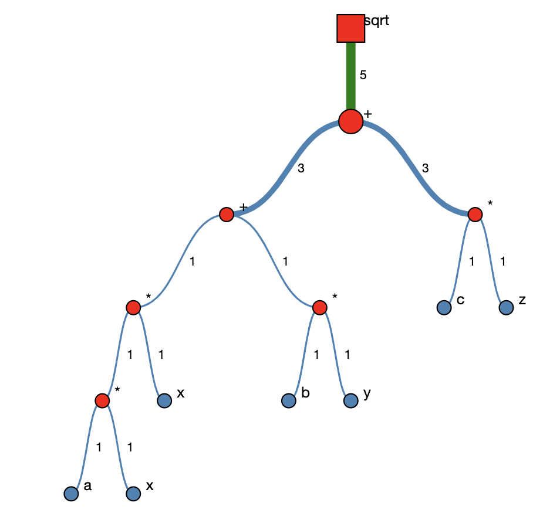

Expression Tree
===============

Goals
-----

The purpose of this assignment is to learn to

1. Learn to use tree structures using BRIDGES
2. Build an expression tree using the BRIDGES TreeElement class
3. Style the tree nodes and  links.

You will generate a visualization of the tree that looks like 

Programming part
----------------

### Task

### Getting Started

1. Open your scaffolded code.
2. Plug in your credentials.
3. Review the  Tree tutorial [here](http://bridgesuncc.github.io/tutorials/Tree.html)
4. Create Tree elements to represent the expression **sqrt(ax^2 + by + cz)**
5. You will create the tree manually by creating a node for each of the elements
in the expression.
6. Style the tree using different colors for the operands and operators, adjust
thickness of links, or even shapes of the nodes.
8. Compile, run, and visualize and you should see the output above. You can use
the key 'l' to display the lables, or mouse over the nodes.

### Help

#### for Java

[Tree Element Documentation](http://bridgesuncc.github.io/doc/java-api/current/html/classbridges_1_1base_1_1_tree_element.html)

[ElementVisualizer documentation](http://bridgesuncc.github.io/doc/java-api/current/html/classbridges_1_1base_1_1_element_visualizer.html)

[LinkVisualizer documentation](http://bridgesuncc.github.io/doc/java-api/current/html/classbridges_1_1base_1_1_link_visualizer.html)

#### for C++

[Tree Element Documentation](http://bridgesuncc.github.io/doc/cxx-api/current/html/classbridges_1_1datastructure_1_1_tree_element.html)

[ElementVisualizer documentation](http://bridgesuncc.github.io/doc/cxx-api/current/html/classbridges_1_1_element_visualizer.html)

[LinkVisualizer documentation](http://bridgesuncc.github.io/doc/cxx-api/current/html/classbridges_1_1_link_visualizer.html)

#### for Python
[Tree Element Documentation](http://bridgesuncc.github.io/doc/python-api/current/html/classbridges_1_1tree__element_1_1_tree_element.html)

[ElementVisualizer documentation](http://bridgesuncc.github.io/doc/python-api/current/html/classbridges_1_1element__visualizer_1_1_element_visualizer.html)

[LinkVisualizer documentation](http://bridgesuncc.github.io/doc/python-api/current/html/classbridges_1_1link__visualizer_1_1_link_visualizer.html)
